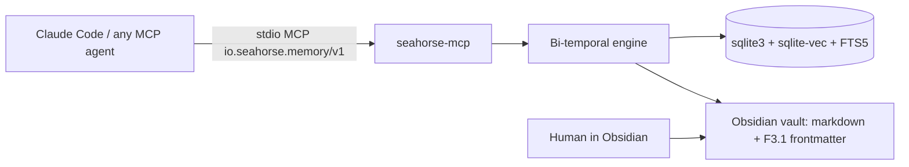

# Seahorse

[](https://github.com/ssanvi-builds/seahorse/actions)
[](LICENSE)
[](https://pypi.org/project/seahorse-memory)
[](https://pypi.org/project/seahorse-memory)
[](https://github.com/ssanvi-builds/seahorse/releases)


Persistent, bi-temporal memory for LLM agents — local-first, MCP-native,
Obsidian-readable.

```bash
uv tool install seahorse-memory --with "seahorse-memory[embeddings,llm]"
seahorse setup
```

That second command is the whole onboarding. It configures everything: a vault
(portable `~/seahorse-mem` default), the database, Claude Code capture hooks,
a running observer, the user-scope MCP registration, the agent instructions
block, the packaged agent skills, and a self-tested LLM provider when one is
available. It always exits 0 — every step that cannot complete degrades to a
WARN line with the exact fix, instead of failing. Verify with `seahorse
--version` and `seahorse doctor`.

## Why

LLM agents start every session from zero. The context window is not memory: it
is a scratchpad that resets, and it is too small to hold what an agent has
learned across weeks of work. The tools that try to fix this have their own
problems:

- **They forget badly.** Most memory systems accumulate facts forever and never
  resolve contradictions — an agent "remembers" that a user lives in Madrid and
  Barcelona at the same time, with no way to know which is current.
- **They are opaque.** Memory lives in a proprietary database the human cannot
  read, edit, or audit. If the agent is wrong, there is no way to correct it.
- **They are expensive to feed.** Every episode goes through an LLM, so writing
  thousands of small facts costs real money.
- **They lock you in.** Adopting a memory system often means adopting its
  runtime, its provider, or its ecosystem.
- **Their benchmarks are not trustworthy.** The field's own numbers are hard to
  reproduce: the LOCOMO benchmark has 6.4% wrong gold answers, Mem0's
  reproduction is broken (issue
  [#2800](https://github.com/mem0ai/mem0/issues/2800)), and MTEB embedding
  scores do not predict memory-retrieval performance (LMEB, arXiv
  [2603.12572](https://arxiv.org/abs/2603.12572)).

Seahorse is a different approach: an **open, portable, bi-temporal memory
standard** that an agent writes to and reads from, that a human can read and
correct, and that does not lock you into any runtime or provider.

## Who it's for

- **Developers building agents** (Claude Code, Cursor, Codex, or your own) who
  want the agent to remember decisions and context across sessions.
- **Obsidian power users** who want their notes to be more than a static
  archive — a knowledge base an agent can query and maintain.
- **Teams that want portable memory** — a format they can migrate between
  vendors without replaying history.

## Quickstart

```bash
# Install (with the optional extras — semantic retrieval + multi-LLM extraction):
uv tool install seahorse-memory --with "seahorse-memory[embeddings,llm]"
# …or with pip:
pip install "seahorse-memory[embeddings,llm]"

# One command, everything configured (vault, DB, hooks, observer, MCP,
# agent instructions, skills, self-tested LLM provider). Exit 0 always:
seahorse setup
# Force a specific vault (created if missing):
seahorse setup --vault ~/obsidian-vaults/myvault

# Verify the whole chain end to end (and attempt the repairs Seahorse owns):
seahorse doctor --fix

# Use it — in any Claude Code session the agent now has the memory tools;
# sessions are captured automatically. From the shell:
seahorse remember "Sergio lives in Madrid" --title home
seahorse recall "where does Sergio live?"
```

Without a terminal (an agent running onboarding unattended), setup bootstraps
the portable per-user default `~/seahorse-mem` instead of failing — it never
hits a cold-start prompt. On a terminal it offers an interactive picker of
your registered Obsidian vaults.

> **First run**: the semantic-embedding model (mE5-small, ~235MB) downloads
> lazily on the first `remember`/`recall` — the CLI announces it so the first
> call doesn't look hung. `seahorse setup --warm-embeddings` pre-downloads it.

### Setup reference

Every step is opt-out-able; every step is idempotent — run setup twice, nothing
duplicates.

| Flag | Effect |
|------|--------|
| `--vault <path>` | Use (and bootstrap) this vault instead of resolution. |
| `--no-mcp` | Skip the user-scope MCP registration. |
| `--no-agent-instructions` | Skip the `~/.claude/CLAUDE.md` instructions block. |
| `--no-skills` | Skip installing the packaged agent skills. |
| `--skip-llm` | Skip provider detection + live self-test. |
| `--warm-embeddings` | Pre-download the embeddings model (~235MB). |
| `--auto-consolidate` | Opt in: distill at the Claude Code Stop event. |
| `--uninstall` | Symmetric removal (see below). |

**LLM provider.** Setup detects providers in preference order — local Ollama
(qwen3 first), then cloud keys present in the environment (Gemini, Groq,
OpenRouter, OpenAI, Anthropic, DeepSeek) — and writes the `[llm]` config only
after a passing live self-test, so `seahorse doctor` never reports a default
that was never verified. If nothing passes, an interactive terminal offers to
pull a local Ollama model, paste a cloud API key, or skip (the default — big
downloads never happen on a bare Enter). A pasted key is stored in the
credentials store: `~/.config/seahorse/credentials.json`, mode 0600, atomic
writes, never in `seahorse.toml`, values never printed. Headless commands and
`seahorse doctor` load the store automatically; pre-existing environment
variables win.

**Uninstall.** `seahorse setup --uninstall` removes the hooks, the `[observe]`
section, the MCP registration, the instructions block, and the packaged skills,
and stops the observer. The vault, its notes, `[materialize]`, and the global
pointer stay — your memory is yours.

### The loop

What the setup buys you, in use:

1. **Capture.** The hooks record every Claude Code session as episodes —
   skip-first (near-zero cost), redacted, with a deterministic summary. The
   observer self-heals: if the worker dies, the next hook fires it back up, and
   events it cannot deliver are spooled losslessly and drained on restart.
2. **Recall.** The SessionStart hook injects `seahorse context` into the next
   session, so the agent starts with what it learned before — pointing at the
   seahorse-mcp tools first, the CLI as fallback.
3. **Write back.** The agent reads and writes memory through the MCP tools
   (`recall`, `remember`, `improve`…) instead of guessing.
4. **Distill.** Setup installs a `consolidate` skill into `~/.claude/skills/`,
   so an agent session can run the distillation itself and enrich the notes
   with the MCP tools — the agent's own LLM does the synthesis, so
   consolidating needs no API key. Prefer it on a schedule? `seahorse setup
   --auto-consolidate` runs `seahorse consolidate --auto` at the Stop event
   (opt-in; off by default, and a config edit turns it off again).
5. **Human in the loop.** Episodes and distilled notes are markdown files in
   the same vault you edit in Obsidian — readable, diffable in git, auditable.
   If the agent is wrong, you correct the note, not a database.

## Use it from an agent (MCP)

Seahorse is built for agents: the memory surface is a stdio MCP server
(`io.seahorse.memory/v1`) that any agent that speaks MCP can connect to. The
CLI is for humans and scripts; agents talk to `seahorse-mcp`.

`seahorse setup` registers the server in Claude Code automatically (user
scope). The vault resolves dynamically at each call — the vault containing the
current working directory, else the per-user default — so one registration
serves every project and every vault.

Manual alternatives, when you need them:

```bash
# Register by hand (the `--` separates Claude's own flags from the server command):
claude mcp add seahorse-mcp -- seahorse-mcp
```

```json
// .mcp.json at the project root — shares the server with a team via git:
{
  "mcpServers": {
    "seahorse-mcp": {
      "type": "stdio",
      "command": "seahorse-mcp"
    }
  }
}
```

Note: `~` is not expanded in `.mcp.json` — use `${HOME}` or an absolute path.
(`mcpServers` in `settings.json` is silently ignored; MCP servers live in
`~/.claude.json` for user/local scope and in `.mcp.json` for project scope.)

Once connected, the agent sees the 14 memory tools — see
[The agent surface](#the-agent-surface--7-memory-native-primitives--7-proceduralread-only-tools).
The observer is a separate piece: it *captures* Claude Code sessions into
episodes; the MCP server is how the agent *reads and writes* memory. Both work
together — capture sessions, then recall across them.

## How it works



An agent talks to `seahorse-mcp` over stdio MCP. The engine stores every
episode twice: once in a single-file SQLite database (sqlite-vec for vector
search, FTS5 for full-text), and once as a markdown file with F3.1 frontmatter
in the vault. The human edits the same markdown. The format is versioned and
documented in [docs/f3.1-format.md](docs/f3.1-format.md).

What that looks like on disk: the memory graph of a fictional demo vault
([examples/demo-vault/](examples/demo-vault/), 105 F3.1 episodes — projects,
people, decisions, sessions — entirely invented, nothing real). Red edges are
`supersedes` chains: a correction never overwrites, it appends.


Open [examples/demo-vault/graph.html](examples/demo-vault/graph.html) for the
same graph, interactive (zoom, pan, drag, tooltips — self-contained, no
dependencies). Every note in the folder is a valid F3.1 episode you can open
in Obsidian; the graph is regenerated with `python3 render_graph.py`.

## The agent surface — 7 memory-native primitives + 7 procedural/read-only tools

Exposed over stdio MCP (`io.seahorse.memory/v1`, protocol pinned `2025-11-25`) and
mirrored on the CLI. These are memory primitives, not generic CRUD: an agent calls
`remember` / `recall` / `improve` / `forget` the way a human would talk about memory.

The 7 primitives (write + retrieve):

| Primitive | What it does |
|-----------|--------------|
| `remember` | Record an episode (body, source, optional title/subject). |
| `recall` | INDEX level — the current-state listing, clamped to `top_k`. |
| `recall_timeline` | TIMELINE level — the supersedes chain around an anchor episode. |
| `recall_full` | FULL level — the hydrated episode with all provenance. |
| `improve` | Supersede an episode with a corrected one (append-only). |
| `forget` | Soft-delete an episode (append-only; history preserved). |
| `build_pit` | Build a point-in-time projection (all-None → current state). |

Plus 7 procedural / read-only tools (skills + facade introspection):

| Tool | What it does |
|------|--------------|
| `skill_add` | Create a procedural skill (deterministic, near-zero cost). |
| `skill_show` | Show a skill's gated body (trust gate). |
| `skill_list` | List procedural skills (Discovery level). |
| `skill_search` | Search procedural skills (hybrid recall, procedural filter). |
| `freshness_view` | Freshness snapshot of an episode (age, stale, pending_ingest). |
| `audit_log` | Audit events for an episode (write-path history). |
| `follow_supersedes_chain` | The supersedes closure for an episode (version history). |

Three retrieval levels give **progressive disclosure**: a cheap listing first
(INDEX), the chain on demand (TIMELINE), and the full record only when needed
(FULL). This keeps the common path cheap.

## Everyday commands

The CLI mirrors the agent surface for humans, scripts, and cron jobs:

```bash
seahorse remember "deployed the API behind auth" --title deploy
seahorse improve <ep_id> "deployed the API behind oauth" --reason correction
seahorse forget <ep_id> --reason done
seahorse recall "what did we decide about the API design?"
seahorse observe status              # capture worker state
seahorse consolidate                 # batch-distill episodes into a note
seahorse materialize                 # backfill distilled notes into Memory/
seahorse import --mode commit        # migrate claude-mem observations
seahorse doctor --fix                # diagnose + repair what Seahorse owns
seahorse setup --uninstall           # remove the surfaces, keep the vault
```

## Your vault stays yours

- **Python ≥ 3.11** is the only requirement. The interpreter's `sqlite3` must
  support `enable_load_extension` (sqlite-vec needs it); most standard builds do
  — `seahorse doctor` reports it as a FAIL if not.
- **Obsidian is optional.** Seahorse runs on any directory of markdown —
  `seahorse init` creates a `.seahorse/` sidecar in a plain folder. Obsidian is
  a human-facing editor for the same folder; its `.obsidian/` directory is
  ignored by Seahorse, never required.
- **Legacy vaults migrate.** A vault of pre-existing Obsidian notes (no
  frontmatter, or legacy `tags`/`created` frontmatter) is not yet in the
  canonical format — `seahorse index rebuild` fails honestly on those notes.
  `seahorse frontmatter migrate` converts them:

```bash
# Preview: classify every note, write nothing (always exit 0):
seahorse frontmatter migrate --vault myvault --dry-run
# Apply: convert legacy notes, leave canonical notes untouched, refuse
# incompatible notes (exit 97 — the manifest names which need manual work):
seahorse frontmatter migrate --vault myvault
# Rebuild the sidecar index from the converted notes:
seahorse index rebuild --vault myvault
```

`--resume` skips notes unchanged since the last manifest; `--batch-size` sets
the checkpoint cadence. Migration works before `seahorse init` (it only
touches `.md` files + the manifest).

## Compared to other memory tools

A comparison of verified facts, not a ranking. Sources: the project's
state-of-the-art analysis (see the [research
notes](https://github.com/ssanvi-builds/seahorse) and the claims cited below).

| | Seahorse | mem0 | Letta / MemGPT | Zep / Graphiti | claude-mem | LangMem |
|---|---|---|---|---|---|---|
| **Portable open format** | ✓ F3.1 spec | ✗ proprietary | ✗ runtime-bound | ✗ | ✗ own schema | ✗ |
| **Human-readable layer** | ✓ Obsidian vault | ✗ | ✗ | ✗ | ✗ | ✗ |
| **Bi-temporal (point-in-time)** | ✓ | ~ | ~ | ✓ Graphiti | ✗ | ✗ |
| **Local-first, zero-infra** | ✓ | ~ | ~ | ✗ cloud-only | ✓ | ~ |
| **Reproducible benchmark** | ✓ harness in-repo | ✗ [#2800](https://github.com/mem0ai/mem0/issues/2800) | — | — | — | — |
| **License** | Apache-2.0 | Apache-2.0 (open-core) | Apache-2.0 | Apache-2.0 | AGPL | Apache-2.0 |

Legend: ✓ yes · ~ partial · ✗ no · — not verified.

The two facts that matter most: **mem0 paywalls the features that produce its
benchmark numbers**, and **Zep abandoned self-host for cloud-only**. Seahorse
is local-first by default, publishes its benchmark harness in the repo, and
keeps the memory format portable so you are never locked in.

## Benchmark

Seahorse ships a reproducible benchmark harness (LMEB-S, a subsample of the
LongMemEval benchmark) and publishes its own numbers — with caveats. The point
is not a leaderboard; it is an honest, reproducible measurement.

| Metric | Value | Note |
|---|---|---|
| recall@10 | 0.13 | knowledge-update slice: 0.44 |
| ndcg@10 | 0.11 | |
| mrr | 0.13 | knowledge-update slice: 0.47 |
| precision@10 | 0.02 | |
| token efficiency | 0.998 | 51.5M tokens full-context → 121K measured |
| latency p95 (INDEX) | 42 ms | retrieval-only, no rerank |

Caveats: the run uses a **subsample** (n≈470–500 questions, not the full
dataset); relevance is judged by a **small LLM without human validation**; and
it measures **retrieval only**, not the agent's final answer. A cross-encoder
rerank was tested and **rejected** — it degraded recall@10 to 0.11 with 1.2s
latency. Full methodology and reproduction commands in
[docs/benchmark.md](docs/benchmark.md).

> These numbers measure **retrieval ranking only** on a subsample with a small
> judge — they are **not comparable** to the end-to-end accuracy scores other
> memory systems publish (e.g. Graphiti 63.8%, Mem0 94.8, Hindsight 91.4%).
> See [docs/benchmark.md](docs/benchmark.md) for how not to compare.

## FAQ

**What is an episode?** A single memory record: a markdown file with YAML
frontmatter carrying two time axes (`valid_at` — when it became true, and
`created_at` — when it was recorded), provenance, and a cognitive type. The
format is versioned and documented in [docs/f3.1-format.md](docs/f3.1-format.md).

**How is this different from claude-mem?** claude-mem stores session
observations in its own schema. Seahorse is an open, bi-temporal standard with
a portable format and a human-readable layer — and `seahorse import` migrates
claude-mem observations into canonical episodes, so it is a bridge, not a
competitor.

**Do I need an LLM?** No. The deterministic skip-path is the default for the
bulk of writes (near-zero cost). LLM extraction is optional
(`seahorse-memory[llm]`) and reserved for the few episodes that justify it.
Even distillation works without an API key: the packaged `consolidate` skill
has the agent's own LLM do the synthesis through the MCP tools.

**Is it free?** Yes. Apache-2.0, local-first, zero-infra. A managed SaaS and
enterprise tier are planned for the future (see the project's strategy notes).

## What works

- Bi-temporal, append-only episode store on stdlib `sqlite3` + sqlite-vec (FTS5
  + vec0). Auto-migrating schema.
- The 7 memory-native primitives plus 7 procedural / read-only tools, on both
  the CLI and stdio MCP (14 tools total).
- Progressive disclosure (INDEX / TIMELINE / FULL) and point-in-time projection.
- **Hybrid semantic retrieval**: `recall` ranks by relevance — sqlite-vec
  kNN + FTS5 BM25 fused with Reciprocal Rank Fusion, with point-in-time
  routing (`state_at` / `known_at`) when a real embedder is wired. The write
  path and `seahorse index rebuild` populate vec0/FTS (best-effort — an
  embedder failure never fails the episode write).
- **Honest degrade**: without the `embeddings` extra (or with no vectors
  populated), `recall` falls back to the current-state listing (score 0.0, no
  ranking) and point-in-time recall is refused — the engine keeps working
  without ranking.
- **Opt-in decay ranking (default-off)**: a FAMA-style Ebbinghaus forgetting
  curve downweights stale knowledge by age (`score' = score · 2^(-age/half_life)`),
  with per-type half-life priors. Off by default: the pure-RRF fingerprint stays
  bit-comparable.
- **LLM extraction**: a real multi-LLM path (ollama / gemini / groq /
  openrouter / openai / anthropic / deepseek / vllm, local-first) with a strict
  schema validator + repair loop, retry/fallback chain, and an operative cost cap
  (local and free-tier models price at $0). `seahorse setup` detects and
  self-tests a provider; the skip-path stays the near-zero-cost default for the
  bulk of writes.
- **Local-first CI gate**: the real extraction path runs in CI against the
  weakest model of the family (`ollama/qwen3:0.6b`) so the validator + repair
  must carry the load — the path does not silently depend on native structured
  outputs or a strong model.
- Supersession (`improve`) and soft-delete (`forget`) with full history preserved.
- **Batch distillation** (`seahorse consolidate`): distill many episodes into a
  single consolidated note — deterministic by default, with opt-in LLM synthesis
  (`--synthesis llm`) and supersession (`--supersede`) so the consolidated note
  supersedes its sources. Non-human rivals are absorbed; human-authored notes
  always win.
- **Materialization** (`[materialize]`, default `consolidated`): distilled
  knowledge and project notes become visible, editable F3.1 `.md` notes in the
  vault (`Memory/` by default) — the agent works with the same notes the human
  reads and edits. A human body edit survives (the guard compares frontmatter
  ids, not mtimes); `forget`/`improve`/supersession invalidate the note by
  merging `invalid_at` (never overwriting); collisions are reported, never
  silently resolved. `seahorse materialize` backfills; `seahorse setup` writes
  the section. See `docs/editorial-notes.md` for the pattern.
- Frontmatter import/export for the Obsidian vault layer (markdown as the
  human-readable, portable on-disk contract).
- **Legacy-vault migration**: `seahorse frontmatter migrate` converts legacy
  Obsidian notes with a `--dry-run` preview, `--resume`, and honest exit `97`
  when incompatible notes block a full migration.
- **One-command onboarding**: `seahorse setup` configures the whole stack
  (vault, DB, hooks, observer, MCP, agent instructions, skills, provider) and
  always exits 0; `seahorse doctor --fix` diagnoses and repairs the chain.
- Honest exit codes and a structured `{"error": {...}}` envelope on stderr, so
  agents and scripts can branch on `seahorse_code` / `cli_code` deterministically.

A few CLI commands are wired but intentionally return exit `75` with a reason
(`expire`, `revalidate`, `index verify`), so the surface is honest about what is
not implemented yet rather than silently no-op'ing. `llm_partial` stays fully
reserved.

## Stack

- Python ≥ 3.11. stdlib `sqlite3` + sqlite-vec for storage (zero-infra single
  file; the `vec0` virtual table + FTS5).
- numpy for the embedding blob shape.
- Pydantic v2 for the canonical `Episode` contract (core type system).
- Typer for the CLI surface (humans and scripts). Confined to `seahorse.cli`.
- stdio JSON-RPC 2.0 for the MCP agent surface (hand-rolled framing, stdlib-only
  `seahorse.mcp` package — `import seahorse.mcp` does not load Typer).
- `ruamel.yaml` + `python-frontmatter`, confined to the frontmatter adapter.
- **FastEmbed ONNX + onnxruntime** (`embeddings` extra, NOT in the default
  install): the mE5-small bundle defaults to `model_O4.onnx` (fp32, ~235MB) — no
  int8/fp16 artifact is portable to Apple Silicon, and an open standard must run
  on Windows/Linux/macOS. A portable int8 bundle is a measured follow-up.
- **LiteLLM** (`llm` extra, NOT in the default install): unifies the 100+
  provider surface for the LLM extraction path. Without the extra, `seahorse.llm`
  still imports (contract + `StubLLMClient`) and the real path degrades llm→skip
  with a setup hint.

> The FastAPI / SQLAlchemy / Postgres stack is planned for a later multi-agent
> tier (Postgres + pgvector). The README states what ships now, not the target
> architecture.

## Testing

- **Unit + integration**: `uv run pytest` (coverage ≥ 80% gate).
- **Fresh-user e2e**: `scripts/e2e-fresh-user.sh` — the full install → setup →
  core CLI → embeddings → LLM → import → MCP flow from a clean, isolated HOME
  (never touches the real `~/.claude` / `~/.claude-mem`).
- **Environment matrix**: `scripts/e2e-matrix.sh` — the fresh-user flow across
  environment combinations (install method × extras × Obsidian × Ollama ×
  online/offline × vault state × concurrency). `--ci-subset` runs the CI-safe
  combos (`core_min` + `uv_sync_dev`); `--list` shows all combos.
- **Core stress**: `scripts/stress-core.sh` — ingest 1000+ episodes, recall
  `--top-k 100` p95 ≤ 250ms (in-process INDEX budget), concurrent single-writer,
  reindex, idempotent import, improve/forget chain.

## Contributing

Contributions are welcome. See [CONTRIBUTING.md](CONTRIBUTING.md) for the
development setup, test/lint commands, and pull request workflow. Release history
lives in [CHANGELOG.md](CHANGELOG.md).

## License

Apache-2.0. See [LICENSE](LICENSE).

## Current status

**v0.22.0.** The full agentic loop works end to end from a one-command setup:
sessions are captured automatically, recalled across sessions (hybrid semantic
retrieval when vectors are populated, honest listing otherwise), the agent
reads and writes memory over stdio MCP, and batch distillation turns episodes
into consolidated notes that materialize in the vault. The benchmark harness
ships in the repo with caveats in [docs/benchmark.md](docs/benchmark.md). See
[What works](#what-works) for the inventory and [ROADMAP.md](ROADMAP.md) for
what is next.