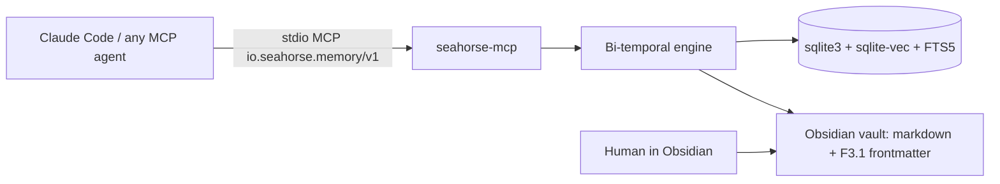

# Seahorse

[](https://github.com/ssanvi-builds/seahorse/actions)
[](LICENSE)
[](https://pypi.org/project/seahorse-memory)
[](https://pypi.org/project/seahorse-memory)


Persistent, bi-temporal memory for LLM agents — local-first, MCP-native,
Obsidian-readable. This is what your agent's memory looks like — a markdown
file you can read in Obsidian, diff in git, and edit by hand (abridged):

```markdown
---
id: 019bb17c-12cb-7224-8ade-a3d0362d6d75
created_at: '2026-01-12T09:14:17.163477Z'
schema_version: 1.0.0
provenance:
  agent_id: seahorse/claude-code
  confidence: 0.97
  extraction_mode: llm
  model_used: claude-sonnet-5
  source_type: agent
valid_at: '2026-01-12T00:00:00Z'
cognitive_type: social
source_type: agent
title: Alex Vega works as a data engineer
tags: []
---
# Alex Vega works as a data engineer

Alex Vega is a data engineer at [[Northwind Analytics]], working remotely.
```

```bash
uv tool install seahorse-memory --with "seahorse-memory[embeddings,llm]"
seahorse setup
```

That second command is the whole onboarding — vault, database, capture hooks,
observer, MCP registration, agent instructions, skills, LLM provider. It always
exits 0: steps that cannot complete degrade to a WARN line with the exact fix.
Full flags and uninstall in [docs/setup.md](docs/setup.md).

## Quickstart

```bash
uv tool install seahorse-memory --with "seahorse-memory[embeddings,llm]"  # or: pip install "seahorse-memory[embeddings,llm]"
seahorse setup                                                            # everything configured; --vault ~/myvault to pick one
seahorse remember "Sergio lives in Madrid" --title home
seahorse recall "where does Sergio live?"
```

Real output of that fresh install:

```text
$ seahorse remember "Sergio lives in Madrid" --title home
✓ Remembered
  fact_id:    4ea140588150773ce3aace786aeef7f4
  ep_id:      01a08b81-5b47-7e22-8ec8-e9f321f85534
  status:     ACTIVE
  collisions: 0

$ seahorse recall "where does Sergio live?"
Recall: 'where does Sergio live?' (1 results)

  #  ep_id                              subject                          stale  pending
  1  01a08b81-5b47-7e22-8ec8-e9f321f85534 home                             no     no

  Use `seahorse recall-timeline <ep_id>` for the chain.
  Use `seahorse recall-full <ep_id> ...` to hydrate body.
```

> **First run**: the embedding model (mE5-small, ~235MB) downloads lazily on the
> first `remember`/`recall`; `setup --warm-embeddings` pre-downloads it.

The full agentic loop ships since v1.0.0, end to end from that one command.
What's next: [ROADMAP.md](ROADMAP.md).

## Why

LLM agents start every session from zero: the context window is a scratchpad
that resets. The tools that try to fix this have their own problems:

- **They forget badly.** Most accumulate facts forever and never resolve
  contradictions — an agent "remembers" Madrid and Barcelona at once, with no
  way to know which is current.
- **They are opaque.** Memory lives in a proprietary database the human cannot
  read, edit, or audit — if the agent is wrong, there is no way to correct it.
- **They are expensive and locking.** Every episode goes through an LLM (real
  money at scale), and adoption means adopting the vendor's runtime or
  provider.
- **Their benchmarks are not trustworthy.** The field's own numbers are hard to
  reproduce: the LOCOMO benchmark has [6.4% wrong gold answers](https://github.com/dial481/locomo-audit/blob/main/AUDIT_REPORT.md) (Penfield Labs audit), Mem0's
  reproduction is broken (issue
  [#2800](https://github.com/mem0ai/mem0/issues/2800)), and MTEB embedding
  scores do not predict memory-retrieval performance (LMEB, arXiv
  [2603.12572](https://arxiv.org/abs/2603.12572)).

Seahorse is a different approach: an **open, portable, bi-temporal memory
standard** that an agent writes to and reads from, that a human can read and
correct, and that does not lock you into any runtime or provider. Its F3.1
format is the only markdown-native interchange spec with bi-temporal timestamps
and append-only supersession with a recorded reason that the landscape review
found ([docs/related-work.md](docs/related-work.md)).

Who it's for: **developers building agents** (Claude Code, Cursor, Codex, or
your own), **Obsidian power users** who want their notes queryable, and
**teams** that want memory they can migrate without replaying history.

## How it works



An agent talks to `seahorse-mcp` over stdio MCP. The engine records every
episode in a single-file SQLite database (sqlite-vec for vector search, FTS5
for full-text) and `seahorse materialize` publishes distilled notes to
`Memory/` as F3.1 markdown (`--mode all`: every episode) — the human edits
the same notes. Format spec: [docs/f3.1-format.md](docs/f3.1-format.md).

And this is what the memory graph of a vault looks like — a fictional demo
vault ([examples/demo-vault/](examples/demo-vault/), 115 F3.1 notes: 92
episodes, 8 ringed `consolidate` notes in `Memory/`, 15 human notes —
invented, nothing real). Red edges are `supersedes` chains: a correction
never overwrites, it appends. [graph.html](examples/demo-vault/graph.html)
is the same graph, interactive (zoom, pan, drag, tooltips — self-contained).


## The loop

1. **Capture.** Hooks record every Claude Code session as episodes — skip-first,
   near-zero cost, redacted. The observer self-heals (the next hook refires it).
2. **Recall.** The SessionStart hook injects `seahorse context` into the next
   session, so the agent starts with what it learned before.
3. **Write back.** The agent reads and writes memory through the MCP tools, not
   by guessing; at design decisions it writes ADR-style notes in `Memory/`.
4. **Distill.** The `consolidate` and `session-note` skills distill recurrent
   episodes and session takeaways into notes — no API key needed.
5. **Human in the loop.** Notes are markdown files you edit in Obsidian — if the
   agent is wrong, you correct the note, not a database.

## Connect your agent

`seahorse setup` registers the server in Claude Code automatically (user
scope); `seahorse setup --harness codex,cursor,vscode,antigravity,gemini`
registers it in the other MCP agents (per-harness details in
[docs/connect.md](docs/connect.md); Codex additionally gets the same automatic
session capture as Claude Code). The vault resolves dynamically at each call —
the vault containing the working directory, else the per-user default.

Manual alternatives, when you need them (`claude mcp add seahorse-mcp --
seahorse-mcp` for Claude's CLI):

```json
// .mcp.json at the project root — shares the server via git (~ is not expanded here: use ${HOME})
{ "mcpServers": { "seahorse-mcp": { "type": "stdio", "command": "seahorse-mcp" } } }
```

Once connected, the agent sees the 15 memory tools — see
[The agent surface](#the-agent-surface). The observer is a separate piece: it
*captures* Claude Code sessions into episodes; the MCP server is how the agent
*reads and writes* memory.

## The agent surface

Exposed over stdio MCP (`io.seahorse.memory/v1`, protocol pinned `2025-11-25`)
and mirrored on the CLI — memory primitives, not generic CRUD: the agent calls
`remember` / `recall` / `improve` / `forget` the way a human talks about memory.

| Primitive | What it does |
|-----------|--------------|
| `remember` | Record an episode (body, source, optional title/subject). |
| `recall` | INDEX level — the current-state listing, clamped to `top_k`. |
| `recall_timeline` | TIMELINE level — the supersedes chain around an anchor episode. |
| `recall_full` | FULL level — the hydrated episode with all provenance. |
| `improve` | Supersede an episode with a corrected one (append-only). |
| `forget` | Soft-delete an episode (append-only; history preserved). |
| `build_pit` | Build a point-in-time projection (all-None → current state). |

Plus 8 procedural / read-only tools: `skill_add` / `skill_show` / `skill_list`
/ `skill_search` (deterministic skills with a trust gate), `freshness_view`
(age/stale snapshot), `audit_log` (write-path history),
`follow_supersedes_chain` (version history), and `context` (session bootstrap).

Three retrieval levels give **progressive disclosure**: a cheap listing first
(INDEX), the chain on demand (TIMELINE), the full record only when needed (FULL).

## Everyday commands

The CLI mirrors the agent surface for humans, scripts, and cron jobs:

```bash
seahorse remember "deployed the API behind auth" --title deploy
seahorse improve <ep_id> "deployed the API behind oauth" --reason correction
seahorse forget <ep_id> --reason done
seahorse recall "what did we decide about the API design?"
seahorse observe status              # capture worker state
seahorse consolidate                 # batch-distill episodes into a note
seahorse materialize                 # backfill distilled notes into Memory/
seahorse import --mode commit        # migrate claude-mem observations
seahorse doctor --fix                # diagnose + repair what Seahorse owns
seahorse setup --uninstall           # remove the surfaces, keep the vault
```

## Your vault stays yours

**Python ≥ 3.11** is the only requirement — the interpreter's `sqlite3` must
support `enable_load_extension` (sqlite-vec needs it); `seahorse doctor` reports
a FAIL if not. **Obsidian is optional**: Seahorse runs on any directory of
markdown — `seahorse init` adds a `.seahorse/` sidecar.

A vault of pre-existing Obsidian notes (no frontmatter, or legacy
`tags`/`created`) is migrated with `seahorse frontmatter migrate`:

```bash
seahorse frontmatter migrate --vault myvault --dry-run   # preview, write nothing
seahorse frontmatter migrate --vault myvault             # apply; exit 97 if notes need manual work
seahorse index rebuild --vault myvault                   # rebuild the sidecar index
```

`--resume` skips unchanged notes; `--batch-size` sets the checkpoint cadence.

## Compared to other memory tools

Verified facts, not a ranking — sources in
[docs/related-work.md](docs/related-work.md) and the claims cited below.

| | Seahorse | mem0 | Letta / MemGPT | Zep / Graphiti | claude-mem | LangMem |
|---|---|---|---|---|---|---|
| **Portable open format** | ✓ F3.1 spec | ✗ proprietary | ✗ runtime-bound | ✗ | ✗ own schema | ✗ |
| **Human-readable layer** | ✓ Obsidian vault | ✗ | ✗ | ✗ | ✗ | ✗ |
| **Bi-temporal (point-in-time)** | ✓ | ~ | ~ | ✓ Graphiti | ✗ | ✗ |
| **Local-first, zero-infra** | ✓ | ~ | ~ | ✗ cloud-only | ✓ | ~ |
| **Reproducible benchmark** | ✓ harness in-repo | ✗ [#2800](https://github.com/mem0ai/mem0/issues/2800) | — | — | — | — |
| **License** | Apache-2.0 | Apache-2.0 (open-core) | Apache-2.0 | Graphiti Apache-2.0 / Zep proprietary | AGPL | Apache-2.0 |

The two facts that matter most: **mem0's headline benchmark numbers are
produced by its managed platform and platform-only features, which the
open-source library cannot exactly reproduce** (its own eval suite shows ~91%
open-source vs 94.4% platform on LongMemEval; [memory-benchmarks README](https://github.com/mem0ai/memory-benchmarks), [issue #2800](https://github.com/mem0ai/mem0/issues/2800)), and **Zep
discontinued its self-hostable Community Edition in April 2025 and now ships
cloud-only** ([deprecation post](https://blog.getzep.com/announcing-a-new-direction-for-zeps-open-source-strategy/),
[PR #390](https://github.com/getzep/zep/pull/390)), keeping only the Graphiti
engine open source. Seahorse is local-first, publishes its benchmark harness,
and keeps the memory format portable — never locked in.

## Benchmark

Seahorse ships a reproducible benchmark harness (LMEB-S, a subsample of the
LongMemEval benchmark) and publishes its own numbers — with caveats. Not a
leaderboard; an honest, reproducible measurement.

| Metric | Value | Note |
|---|---|---|
| recall@10 | 0.13 | knowledge-update slice: 0.44 |
| ndcg@10 | 0.11 | |
| mrr | 0.13 | knowledge-update slice: 0.47 |
| precision@10 | 0.02 | |
| token efficiency | 0.998 | 51.5M tokens full-context → 121K measured |
| latency p95 (INDEX) | 42 ms | retrieval-only, no rerank |

Caveats: the run uses a **subsample** (n≈470–500 questions, not the full
dataset); relevance is **derived from the dataset's golden labels** (no LLM
judge in the scored path); and
it measures **retrieval only**, not the agent's final answer. A cross-encoder
rerank was tested and **rejected** — it degraded recall@10 to 0.11 with 1.2s
latency at the summary representation (a body-rerank experiment later
recovered 0.83, so the rejection is representation-specific). Full methodology
in [docs/benchmark.md](docs/benchmark.md).

> These numbers measure **retrieval ranking only** on a subsample with
> golden-derived relevance labels — they are **not comparable** to the end-to-end accuracy scores other
> memory systems publish (e.g. Graphiti 63.8% with gpt-4o-mini, Mem0 94.8 at top_50, Hindsight 91.4%).
> See [docs/benchmark.md](docs/benchmark.md) for how not to compare.

## Design principles

- **Local-first, zero-infra.** A single SQLite file and a folder of markdown —
  no server, no cloud.
- **Append-only, bi-temporal.** `valid_at` + `created_at` everywhere; `improve`
  supersedes, `forget` soft-deletes — point-in-time recall reproduces any past
  state.
- **Honest degrade.** Without the `embeddings` extra, `recall` falls back to the
  current-state listing and says so — nothing silently degrades.
- **Deterministic default, LLM optional.** The skip-path is the near-zero-cost
  default; LLM extraction (cost-capped) only where it pays.
- **Scriptable, honestly.** Branchable exit codes, a structured error envelope,
  and exit `75` instead of silent no-ops for unimplemented commands.
- **Human edits win.** A human body edit survives; supersession merges metadata
  instead of overwriting.
- **Measured.** 2,800+ tests, coverage gate ≥80%, e2e scripts ([CONTRIBUTING.md](CONTRIBUTING.md)).
- **Additive evolution.** MCP profile and F3.1 format frozen at 1.0; a breaking
  change is 2.0.

## FAQ

**What is an episode?** One memory record: a markdown file with YAML frontmatter
carrying two time axes (`valid_at` — when it became true, `created_at` — when it
was recorded), provenance, and a cognitive type ([docs/f3.1-format.md](docs/f3.1-format.md)).

**How is this different from claude-mem?** claude-mem stores observations in its
own schema; Seahorse is an open, bi-temporal standard with a portable format and
a human-readable layer — `seahorse import` migrates its observations in.

**Do I need an LLM?** No. The deterministic skip-path is the default (near-zero
cost); LLM extraction is optional (`seahorse-memory[llm]`), and even distillation
uses the agent's own LLM.

**Is it free?** Yes — Apache-2.0, local-first, zero-infra. A managed SaaS tier
is planned.

## Contributing

Contributions are welcome — see [CONTRIBUTING.md](CONTRIBUTING.md) for the dev
setup, test/lint commands, and the PR workflow. Release history:
[CHANGELOG.md](CHANGELOG.md).

## License

Apache-2.0. See [LICENSE](LICENSE).

mcp-name: io.github.ssanvi-builds/seahorse-memory