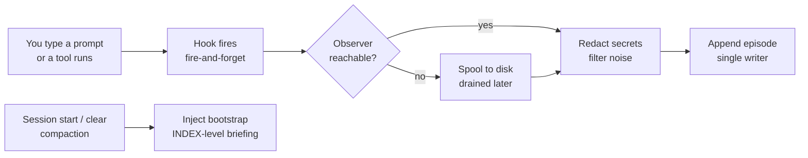

# Seahorse, explained end to end

> This document describes **seahorse-memory v1.5.0**, released 2026-09-19. If
> you are reading it later, check the [CHANGELOG](../CHANGELOG.md) for what has
> changed since.

## Contents

- [Act I — The idea](#act-i--the-idea)
  - [1. What Seahorse is](#1-what-seahorse-is)
  - [2. The problem it exists to solve](#2-the-problem-it-exists-to-solve)
- [Act II — The machine](#act-ii--the-machine)
  - [3. How an agent connects](#3-how-an-agent-connects)
  - [4. The vault: episodes and notes](#4-the-vault-episodes-and-notes)
  - [5. Memory with two clocks: the bi-temporal engine](#5-memory-with-two-clocks-the-bi-temporal-engine)
  - [6. The format as a standard](#6-the-format-as-a-standard)
  - [7. Finding memories: three levels and two librarians](#7-finding-memories-three-levels-and-two-librarians)
  - [8. Writing memories: the agent writes, a budget watches](#8-writing-memories-the-agent-writes-a-budget-watches)
  - [9. Capture: what the camera records](#9-capture-what-the-camera-records)
  - [10. Distillation: from episodes to knowledge](#10-distillation-from-episodes-to-knowledge)
  - [11. Time travel: point-in-time queries](#11-time-travel-point-in-time-queries)
- [Act III — The people](#act-iii--the-people)
  - [12. How real users changed the product](#12-how-real-users-changed-the-product)
  - [13. The field: how Seahorse compares](#13-the-field-how-seahorse-compares)
- [Act IV — Proof and trust](#act-iv--proof-and-trust)
  - [14. Benchmarks that admit their limits](#14-benchmarks-that-admit-their-limits)
  - [15. Privacy, ownership, and trust](#15-privacy-ownership-and-trust)
- [Act V — Boundaries](#act-v--boundaries)
  - [16. What ships and what is destiny](#16-what-ships-and-what-is-destiny)
- [Act VI — The tour](#act-vi--the-tour)
  - [17. A day in the life](#17-a-day-in-the-life)
  - [18. What Seahorse cannot do (yet, or ever)](#18-what-seahorse-cannot-do-yet-or-ever)
  - [19. Frequently asked questions](#19-frequently-asked-questions)
- [Appendices](#appendices)
  - [A. The note format at a glance](#a-the-note-format-at-a-glance)
  - [B. The fifteen tools](#b-the-fifteen-tools)
  - [C. Glossary](#c-glossary)
  - [D. Sources](#d-sources)
  - [E. Version history](#e-version-history)

## Act I — The idea

### 1. What Seahorse is

Imagine arriving at work each morning to discover that your closest colleague has forgotten everything from the day before. Yesterday you walked them through the whole project: where the files live, why you chose one approach over another, what you tried and abandoned. Today they greet you with sincere, fresh-faced curiosity and ask you to explain it all again. The first day it is almost funny. By the end of the week it is exhausting. Within a month you quietly wonder whether working with them is worth the effort.

That is the normal condition of AI assistants. Every conversation starts from zero. The agent that helped you debug an error yesterday does not remember the error existed. You re-explain the context, you re-attach the files, you re-tell what you already tried and why it failed. Inside a single session the assistant can seem brilliant — it holds the thread of the conversation perfectly. Close the window and everything evaporates.

**Seahorse is persistent memory for AI agents**: a system that lets the assistant you work with remember from one session to the next, correct what it gets wrong, and gradually consolidate what it learns — the way a person turns scattered afternoons of experience into durable knowledge.

Two choices make it different from every other memory system this document will describe.

First, **the memory is yours, not the machine's**. Everything Seahorse remembers lives inside one folder you control. The readable layer is plain markdown notes — open, read, and edit them with any text editor, though most people use [Obsidian](https://obsidian.md), a popular note-taking application. Behind them, the engine keeps one ordinary file in the same folder (§7) — a standard, documented format, not a proprietary black box — and how much of the memory appears as notes is a setting you control (§10). If the agent "remembers" something wrong, you open the note, you fix it, done.

Second, **the memory belongs to no vendor**. The notes follow a published, open format, and the agent connects through MCP — the Model Context Protocol, an open standard that has become the common socket by which AI agents attach to outside tools. Any agent that speaks MCP can use Seahorse: Claude Code, Codex, Cursor, VS Code's Copilot, Gemini CLI. Your memory does not die when you switch assistants, because it was never inside the assistant.

This document explains the whole thing: the problem, the machine, the people who shaped it, and its honest limits. It is written for a reader who does not program. Where a technical idea is unavoidable, it is introduced with a plain-language picture first and the precise term second.

### 2. The problem it exists to solve

"Agents forget" is the headline, but the real problem is bigger. Look closely at the memory tools that already exist and six recurring failures appear. Seahorse was designed, decision by decision, against this list.

**1. Nothing forgets sensibly.** Suppose you lived in Madrid for years and moved to Valencia last month. A human stops saying "Madrid" when describing where you live. A typical agent memory does not: it records both facts, keeps both forever, and sometimes answers as if you still live in Madrid, because it cannot tell what is still true from what used to be true. Forgetting, for a machine, is not deleting — it is marking what went obsolete without erasing the history. Almost no tool does this well; they accumulate fact after fact until the agent confuses itself.

**2. The memory is a sealed box.** Most systems store what they learn in a database whose format only specialists can read. If the agent learned something wrong — a preference you never had, a decision it misunderstood — you cannot open a file, cross out the wrong line, and move on. For a tool that claims to be your second memory, that is backwards: you should be able to audit your own memory the way you audit your own notes.

**3. It costs too much to feed.** Some systems send every piece of text through a large language model before storing it. The best-documented example, the engine behind Zep, spends roughly **$0.018 per episode** — about two cents to remember one thing — with six to ten LLM calls per write and thirty to fifty minutes of processing for a few pages of text. That is like paying a secretary to summarize every line of your diary, and waiting half an hour each time. Heavy daily use becomes prohibitively expensive.

**4. It ties you to one vendor.** Several tools depend on proprietary "structured output" features that behave unreliably with open, locally-run models. Your memory works with the vendor's cloud or it does not really work. If you want to move to a local model for privacy or cost, the tool stops serving you.

**5. When two agents disagree, silence wins.** Two assistants working in parallel write contradictory facts — "the main database is Postgres" versus "the main database is SQLite." In most systems one quietly overwrites the other, with no record of which won or why. Memory that cannot explain its own conflicts cannot be trusted.

**6. The yardsticks are broken.** The benchmarks the industry quotes to compare memory systems are themselves unreliable: an independent audit found that **6.4% of LOCOMO's answers** — one of the most-quoted memory benchmarks — are simply wrong, capping any "perfect" score at 93.6%; a rival's published numbers were found not to reproduce from its public code; and vendors have been caught benchmarking their paid cloud platform while marketing the free version. When the ruler is bent, everyone measures tall.

Every design decision you will read about in this document answers one of these six failures: forgetting (§5), transparency (§4, §10), cost (§8), vendor independence (§3, §6), conflict (§5, §12), and honest measurement (§14).

## Act II — The machine

### 3. How an agent connects

An AI agent cannot reach into your files by itself. To let one read your notes, or a calendar, or a database, the industry settled on a common attachment mechanism: the **Model Context Protocol**, or **MCP**. Think of MCP as the USB port of AI. Before USB, every gadget brought its own connector; after USB, one socket serves everything. Before MCP, every tool an agent might use needed a bespoke integration; after MCP, a tool that speaks the protocol works with any agent that speaks it — which today is nearly all of them: Claude Code, Codex, Cursor, VS Code's Copilot, Gemini CLI, and more.

Seahorse is an MCP server. When an agent wants to use its memory, it connects to Seahorse and sees **fifteen memory tools** — the same fifteen for every agent, the same vault, the same rules. It does not matter which assistant you used yesterday or which you will use tomorrow; the memory sits on your side of the socket.

Getting there is two commands. First you install the package:

```bash
uv tool install seahorse-memory --with "seahorse-memory[embeddings,llm]"
```

(The project is published on PyPI, the standard Python package store, as **`seahorse-memory`** — the shorter name `seahorse` was already taken by an unrelated project. The extras in brackets pull in the pieces for semantic search and optional LLM features; more on both later.) Then you run setup:

```bash
seahorse setup
```

Setup registers the memory server with your agent, teaches it how to use the tools, and installs the automatic-capture machinery of §9. It is deliberately careful with your machine: every file it touches is written atomically (with a one-time backup), running it twice changes nothing, anything you wrote yourself is preserved untouched, and a file it cannot parse is left alone with a warning rather than mangled. Setup always exits successfully — problems come back as warnings with instructions, never as a dead end.

The one genuinely interactive moment is the LLM step, and only if you want one: setup offers a local Ollama model first — nothing leaves the machine — accepts a pasted key for the major cloud providers otherwise, and writes nothing to its configuration until the chosen model passes a live self-test. Keys live in a dedicated, permission-locked credentials file — never in the main configuration — and are masked whenever they are displayed.

One registration serves every project. The server figures out *which* memory to use at each call: it looks at the folder the agent is working in, finds the enclosing "vault" (§4), and falls back to your default vault if the current folder has none. Work in your personal project, get that project's memory; work somewhere new, get the default — no per-project configuration.

The same command scales across harnesses — the agent applications just listed. `seahorse setup --harness codex,cursor,vscode,antigravity,gemini,claude-code` registers the server in each agent's own configuration file and, where the harness supports it, installs the same instructions block and **capture hooks** — small programs the agent app runs automatically when session events happen (§9). The one difference that matters for your expectations: **only Claude Code and Codex get automatic capture** (§9). The other harnesses can read and write the memory perfectly well — the agent just has to *choose* to remember, the way you choose to write in a notebook, rather than being recorded as you work.

> [!NOTE] One approval Codex asks of you
> Codex distrusts hooks it has not seen before. After setup, Codex asks you to approve the Seahorse hooks once, through its `/hooks` command. Until you do, capture is silently off — and Seahorse's built-in doctor (§15) notices: it checks whether hooks are installed *and* episodes have actually been arriving, and tells you exactly this if they have not.

### 4. The vault: episodes and notes

Seahorse's memory reaches you through one folder called a **vault**. The vault is not a proprietary container — it is an ordinary directory of markdown files, one subject per folder, that you can browse in any file manager. Obsidian is the recommended way to *read* it, because the notes render nicely there, but it is not required. The vault is your memory precisely because it is not special: plain files, your disk, your backup routine, your rules.

Each file in the vault is one **episode**: a single, atomic unit of memory. "We decided Postgres over Mongo because of the replication requirements" — one episode. "The build broke on macOS because of a Homebrew path difference" — one episode. The unit is deliberately small. Big blobs of everything-that-happened are hard to search, hard to correct, and impossible to retire individually; small units make each of those operations clean.

An episode has two halves. The top is a small block of machine-readable metadata — technically YAML between two `---` lines, a convention Obsidian itself uses — holding the facts *about* the memory: a unique identifier, timestamps, who wrote it, and its classification. The rest of the file is the content itself, preserved **byte-for-byte**: whatever the agent (or you) wrote, exactly as written. The metadata is the machine contract; the body is first-class for both of you. This is the whole point of the transparent design: the agent and the human read the same note.

The classification field is called `cognitive_type`, and it works like the colored forms in an office paper-trail: different colors for different kinds of paper, so the right pile is easy to find.

- **episodic** — things that happened: a debugging session, a conversation, a decision made on a Tuesday. The raw log of working life.
- **semantic** — distilled knowledge: "X is true because Y." What episodes become after reflection (§10).
- **social** — facts about people: names, preferences, how someone likes to receive news.
- **project_doc** — durable project knowledge: design decisions with their rationale, the document-shaped memory of a codebase.

Two more classes, **procedural** (repeatable how-to workflows) and **working** (scratch state), are declared in the format but reserved for the automatic write path: capture never classifies anything as either. The one deliberate exception is the skill store of §10 — procedures you choose to save are stored, today, as episodes typed `procedural`. Everything else about the classes stays a promise with a shape, and §16 explains why.

One real example, from the author's own vault, shows how small an episode is. Mid-session, the author told the agent — in Spanish, translated here — *"I have a copy of the work called 'trabajo personal' on the Desktop, and then the actual work file, which is Article C2 — never write in the first one."* One sentence, spoken in passing, captured automatically as one episodic note. Without memory, next session's agent would not know the rule existed and could plausibly write into the personal copy. With memory, the sentence survives as a note the agent can find before touching anything — and that the human can read, verify, and correct.

The format these files follow is called **F3.1**, and it is published as an open standard rather than kept as an internal detail — which is the subject of §6.

> [!NOTE] Why "metadata" earns its place
> Obsidian users already know frontmatter: the `---` blocks many templates add with tags and dates. Seahorse's block uses the same convention, so its notes look native in an Obsidian vault, render in previews, and never fight your other plugins. The magic is that this ordinary-looking header carries enough structure (identifiers, two clocks, provenance — the who-wrote-it facts) for a database engine to serve thousands of these notes in milliseconds — without the notes ever ceasing to be notes.

### 5. Memory with two clocks: the bi-temporal engine

Here is the quiet idea everything else stands on: **a fact has two different times attached to it, and confusing them is the root of failure mode 1**. The first time is when the fact became true in the world. The second is when the system learned it. They are almost never the same moment. You moved to Valencia on the first of the month; the assistant found out two weeks later when you mentioned it. A newspaper makes the distinction instinctive: there is the news, and there is the day the paper printed it. A memory system that keeps only one timestamp — "updated September 19" — has irrecoverably blended the two.

Seahorse keeps both, on two named axes. The **real-world axis** records when a fact was true: `valid_at` (true starting then) and `invalid_at` (true until then). The **system axis** records the archive's own life: `created_at` (when the episode was written down) and — reserved for a future decay feature — `expired_at` (when the system forgot it). This "two clocks" design has a name, *bi-temporal*, borrowed from database engineering where it solves exactly this class of confusion. It is the same idea Zep/Graphiti uses for its knowledge graph; Seahorse's difference is what it sits on: plain, human-readable markdown notes.

Now the part that makes corrections safe. **Seahorse never edits a memory in place.** It behaves like a bank ledger: entries are appended, corrections create new entries, and nothing is ever scratched out. When you correct a memory — Valencia, not Madrid — the old episode is not overwritten. It is *invalidated*: its `invalid_at` is set to the moment the fact stopped being true, and a new episode is written that *supersedes* it, recording why. The old note stays in the vault, readable, forever. Three things follow from this one rule:

- **"What is currently true" is a query, not a state.** The current truth is simply every episode whose `invalid_at` is empty. No maintenance pass prunes old facts; the engine just refuses to serve invalidated ones as current.
- **History is never destroyed.** The Madrid episode remains, so "where did I live in 2023?" has an answer — and so does the harder question "what did we believe last month?" (§11).
- **Every change leaves a trail.** Alongside the notes, the engine writes an append-only audit row for each write-path action, so "who changed what, when, why" is always answerable.

Even wrong corrections are handled as ledger entries. If the agent tries to correct a memory in a way that would make time run backwards — the "new" fact claims to have been true *before* the thing it replaces — the engine refuses with a named error, `E_MONOTONICITY_VIOLATED`, and nothing is written. If it tries to stamp a correction as *true from* a date that lies in the future, same thing: a different named error, and the write bounces. These guards were not invented in an armchair: an external developer found the exact seam where the two clocks could collide, and the rules above are the fix that shipped (the full story is in §12).

**Remembering ahead of time** is the mirror case. A fact can be recorded *before* it becomes true — an appointment, a planned change, a subscription that ends next month. Such an episode waits in a marked *pending* state and only starts counting as current when its `valid_at` arrives; listings show pending and stale flags explicitly, so "not yet true" and "no longer true" are both visible rather than guessed.

**Forgetting** is the same motion at smaller scale: `seahorse forget` sets `invalid_at` once — a soft delete. The note remains; the engine stops counting it as true. Reversing a deletion ("we actually still use Redis") writes a *new* episode that re-validates the fact; the invalidated version is never resurrected by quietly erasing its tombstone. Every arrow of time points forward.

> [!NOTE] The four invariants, in plain words
> The engine's contract reduces to four sentences. Written facts never change — only new facts are added. The moment a fact stopped being true is written exactly once. A fact cannot be true "until" a moment earlier than it began. And a fact counts as current only while nothing has stamped an end date on it. Everything else — recall, correction, time travel — is built on top of these four, and the engine's own test suite checks them the way a bank audits its ledger.

### 6. The format as a standard

A vault full of episodes is useful to *you*. The reason those notes follow a published specification — rather than whatever shape the code found convenient — is that a memory only you can read is a memory that dies with the tool that made it. The note format, **F3.1**, is the project's answer to failure mode 4: it is the SQL of memory. SQL did not win by being the best database; it won by being the *language* databases agreed on, so data could move between them and skills could transfer. F3.1 aims at the same position: a format any memory system could read and write, so your memory outlives any single product — including Seahorse.

The essentials are already in front of you: markdown, a YAML header, two clocks, append-only supersession with a recorded reason. Two design details make it work as a *shared* standard rather than a private one.

First, **there is an escape hatch for disagreement.** Any field whose name starts with `x-` is a vendor extension, borrowed from the way HTTP headers let systems add metadata without breaking each other. The core rule is two-sided: Seahorse ignores unknown `x-` fields when deciding anything, and preserves them untouched when rewriting a note. Another vendor's importer can therefore stamp its own markers into Seahorse notes without asking permission, and Seahorse's markers survive passage through that vendor's tools. A real exchange has already happened under these rules — an external developer round-tripped Seahorse notes through their own memory system byte-for-byte, proving the format survives contact with a second implementation (§12).

Second, **the format is versioned like a promise.** Every note carries a `schema_version`. Adding an optional field bumps the minor version; old readers keep working. A breaking change would bump the major version, and a reader facing a note from a *higher* major version fails loudly instead of guessing. There is even a promotion path: a vendor extension that proves itself can graduate into a core field. The extension tracking which episodes a distilled note came from (`x-seahorse-derived-from`, §10) has taken the first step: since v1.4.0 the engine writes it itself. Its promotion into the core format waits for the next format-window release — the planned slot in which format changes are allowed — and the current line deliberately does not rush it.

The broader landscape agrees on the *need* but not the format: several interchange proposals exist (the Universal Memory Protocol, MacPaw's Portable Memory, an IETF draft called AIMEM, and others), none with vendor adoption or standards-body backing yet. F3.1's bet is that markdown-nativeness is the missing piece — a memory format humans will actually open — and that bi-temporal timestamps plus append-only correction are the semantics such a format cannot do without.

> [!NOTE] What imports must admit
> A standard that hides what it lost is not a standard. F3.1 requires any importer that cannot represent something to *declare* the loss: the note's provenance block has a slot (`importer_loss`) for exactly that. When Seahorse's own importer pulls in observations from another system, the note records what could not survive the trip — so a future reader never mistakes a faithful copy for a lossy one.

### 7. Finding memories: three levels and two librarians

Memory you cannot find is just disk usage. Retrieval is where a memory system earns its keep, and Seahorse's approach has two halves: how deep you look, and how the ranking is done.

**Depth first.** Recall works at three levels, like a library.

- **INDEX** is the catalog card. A search returns compact rows: the note's subject, a short summary, its classification — *never* the full text. Ten results cost a few hundred tokens of the agent's attention, not thousands.
- **TIMELINE** is the shelf. Given one result as an anchor, it shows the neighborhood: the versions of that fact, its history, what surrounds it.
- **FULL** is the book. It hands over the complete note, but only for the specific ids the agent asks for, in small batches.

This is *progressive disclosure*: cheap to browse, deliberate to open. The design exists because an agent's attention is a budget. An agent that swallows fifty full memories on every question is poor, not smart — it drowns in its own past. One competing tool — met again in §12 — injects thousands of words into every session; the author measured his own pre-migration setup spending 5,000–15,000 tokens before the day's work began. Seahorse instead gives the agent a catalog and lets it decide which books are worth opening — and, as §8 and §9 show, it attaches price tags to the decision.

**Ranking second.** When the INDEX runs a search, two different "librarians" work in parallel. One is **semantic search**: the query and every note are compared as vectors — lists of numbers that encode meaning, so "where do I live?" resembles "moved to Valencia" even with no shared word. This is what the one-time ~235 MB model download behind §3's embeddings extra is for. The other is **keyword search** (BM25, the classic ranking used by search engines): precise matches on the actual words. Neither librarian is right alone — meaning-matching misses exact identifiers like `E_IMPROVE_VALID_AT_FUTURE`; keyword-matching misses paraphrase — so Seahorse fuses their ranked lists with a standard technique called **Reciprocal Rank Fusion** (RRF): each librarian contributes a score based on *where* it placed a note, not how strongly it felt, and the combination is robust to either librarian having a bad day. The fusion's one tuning number was measured, not guessed: every candidate value from 10 to 60 was tried, the results barely moved, and one was pinned.

Both librarians work inside the engine itself: **one SQLite database file**, sitting in a hidden `.seahorse/` folder beside your notes — the engine's store. The vector index (a small extension called sqlite-vec) and the keyword index (SQLite's built-in full-text search, FTS5) are tables inside that single file — no server, no service to babysit. "The database" sounds like infrastructure; here it is one more file that your backups already cover.

**And when the librarians are unavailable? Honesty.** Semantic search needs the embedding model installed. On a bare install without it, Seahorse does something almost no comparable system does: it *says so*. Recall degrades to a simple, recency-ordered listing of current notes and the output tells you what degraded and how to fix it. The author verified this live on his own laptop while writing this document: with the embeddings extra absent, two completely different queries returned the same recency-ordered rows, exactly as a "no semantic ranking installed" warning promises. A system that silently pretends to understand when it is merely listing is lying about the one thing you asked it for.

> [!NOTE] The three levels are a contract, not a suggestion
> Some tools describe progressive retrieval in their prompt text and hope the model complies. In Seahorse the levels are enforced by the code: INDEX cannot emit bodies (the renderer is a pure function that never sees them), TIMELINE takes an anchor, FULL takes explicit ids and serves small batches. The point-in-time queries of §11 exist at INDEX and TIMELINE only — and the tool description the agent reads states that refusal exactly, after v1.5.0 fixed a description that misdescribed it (§11).

### 8. Writing memories: the agent writes, a budget watches

How does a memory *get in*? The industry's visible default — let a large model read everything and extract facts — is the $0.018-per-episode habit from failure mode 3. Seahorse inverts it: **the writing agent writes the memory itself**, as part of doing the work, and the expensive machinery is optional.

The core write is the `remember` tool. When the agent decides something is worth keeping — a decision with its rationale, a root cause that took real work, a preference you stated — it writes a compact note: a meaningful title, a short body, and a small block of *provenance* saying who is writing (`agent_id`, `session_id`, and the source type: agent, human, importer, or system). No extraction model runs. This path is called `skip` mode, and it is the default not out of austerity but out of arithmetic: it costs effectively nothing, so the system can afford to capture *everything* — §9's automatic session capture would be impossible if every captured event cost two cents and half an hour.

When richer processing is wanted — distilling bodies, synthesizing during consolidation — the LLM path exists, with a secretary's budget clause. Every LLM operation runs under a hard cap: **at most $0.002 per episode**, one number defined once and enforced by the runtime on both the write path and the distillation path. If retries push a write toward the cap, the operation *degrades honestly*: it falls back to the deterministic skip path, marks the note `degraded_to_skip`, and proceeds. No silent overspend, ever. The cap is also a design boundary: features that cannot fit inside it do not ship, which is why the whole architecture keeps LLMs out of the hot path — the steps that run on every single write, where speed matters most.

Duplicates get a nudge, not a surprise. Writing a second note about the very same subject does not silently create clutter: the engine detects the collision (same subject, same fact) and returns a one-line hint — use `improve` on the existing note instead. That hint is itself a piece of user-feedback history: an early tester found the original collision message so unhelpful that the fix became a release feature (§12).

Correction, deletion, and the ledger rules were §5. What remains is the question of *when* writing happens automatically — the camera of the next section.

> [!NOTE] Why provenance rides on every note
> The provenance block (who wrote this, in which session, from what kind of source, with which model if any, at what confidence) is not bureaucratic decoration. It is what makes multi-agent memory possible at all: two agents writing the same vault never blur into one voice, a human correction is always distinguishable from an agent's guess, and "which assistant learned this?" has an answer. It is also the raw material of the trust rules in §15.

### 9. Capture: what the camera records

Recall the two failure modes that make agents feel memoryless: they never *write* anything down, and they never *read* what was written. The tools of §3, detailed in §7, solve reading on demand. This section is about the camera that solves writing — automatically, in the two harnesses that support it.

The mechanism is **hooks**: little programs your agent runs when certain things happen. When setup installs the capture machinery, it registers four of them — at session start, at every prompt you type, after every tool the agent uses, and when the session ends. Each hook is a fire-and-forget: the hook hands an event to a small background daemon called the **observer** and returns immediately, so your session never waits on memory. The observer is the system's single writer: it validates, filters, redacts, and appends each event to the engine's store as an episode. If the observer is unreachable when an event fires, the event is not dropped — it is spooled to disk, losslessly, and drained the next time the observer starts. Nothing that was worth capturing is lost to a daemon that was busy booting.

It is a camera, not a court reporter. Two filters stand between the raw session and the vault:

- **Noise never enters.** Deterministic rules drop tool events that are pure mechanics (the equivalents of keystrokes), skip configured tools, and enforce a minimum body size — set by config, not by an LLM's mood. The camera also recognizes the harness's own pseudo-prompts — notification wrappers and reminders the harness injects, not anything you typed — and skips them; before that rule existed, a single harness quirk flooded every vault with eighteen identical junk episodes.
- **Secrets are redacted before anything is stored.** Patterns that look like API keys, tokens, and other credentials are masked at the moment of enqueue, before the event ever reaches the engine's store. Think of a camera that automatically blurs faces: the recording exists, the identity does not.

What lands is the *meaningful* residue of the session — including, verbatim, the prompts you typed. That one-sentence instruction from §4 ("never write in the personal copy on my Desktop") is in the vault because the prompt hook captured it, not because the agent chose to remember it. That is the deepest answer to "agents never write": in Claude Code and Codex, the *human's* words are recorded without anyone deciding anything.

The reading half has its own automation: the **bootstrap**. At session start, a hook injects a briefing into the agent's context — the INDEX-level render of §7: recent valid episodes, last session's episodes, token price tags on the recent-episode and knowledge-note rows, and a pointer telling the agent where the memory tools live. It is the receptionist handing your new colleague the one-page briefing sheet before the meeting: not the whole archive, just "here is what exists, ask for details as needed." The knowledge-note rows carry §10's distilled summaries, and each price tag says what reading that row costs in tokens.

Until v1.5.0 there was a hole in exactly this picture: the briefing was handed over only on *startup*. Two moments of violent amnesia were uncovered — typing `/clear` (wiping the conversation) and **auto-compaction** (the harness silently summarizing the session when it grows too long, discarding the detail). Both destroyed the briefing along with everything else. v1.5.0 widens the trigger so the bootstrap is re-injected at those two moments too:

```text
SessionStart matcher: startup | clear | compact
```

The journey of that one line is a story in itself (§12): it shipped with a bug that silently left existing installs behind, the bug was caught by the project's adversarial-review discipline, and the fix — refresh stale hook entries in place on re-setup, repair a legacy broken shape, and teach the doctor to *warn* when hooks are present but outdated — became the release's headline fix. The design has one deliberate exception: resuming a paused session does **not** re-inject, because the resumed session already carries its own transcript — a second briefing would say the same thing twice.



> [!NOTE] Not every harness has a camera
> Hooks are a Claude Code and Codex capability. In Cursor, VS Code's Copilot, Gemini CLI, and Antigravity, capture is *on intent*: the agent writes memories with `remember` when it judges something durable, and bootstraps itself with the `context` tool at session start. The instructions block setup installs teaches exactly that, and states plainly that no automatic capture exists in that harness. Real memory — with an honest label on how it was gathered.

### 10. Distillation: from episodes to knowledge

Weeks of episodes produce a shoebox of receipts: useful, but nobody reads shoeboxes. Humans handle this by *consolidation* — sleeping on things, noticing the pattern across days, writing the conclusion in the notebook. Seahorse's version is the `consolidate` command, and it is the bridge from `episodic` notes (§4) to `semantic` ones.

Consolidation works in clusters. It groups episodes that keep saying the same thing — a decision that recurs, a problem fixed the same way three times — and requires real recurrence before acting: a cluster needs at least three episodes. For each qualifying cluster it writes one distilled **knowledge note** summarizing what the pattern says, in the same vault, in the same human-readable format. Writing it can be fully deterministic, or the optional LLM path can synthesize it — one call per cluster, under the §8 budget — falling back to the deterministic version on any failure. A third path needs no API key at all: setup installs packaged agent skills (a `consolidate` skill among them) that hand the synthesis to the coding assistant you already pay for.

The distilled note does not betray its sources. Its body carries an **Evidence block**: the episodes it was distilled from, listed and capped, with an honest count if the cap trimmed the list. Structurally, the note's metadata carries the same membership as `x-seahorse-derived-from` — for each source, its id and the kind of edge (evidence, derived, supersedes). A consumer of the vault can reconstruct which episodes fed which conclusions without reimplementing anything. That field began as an extension, proved itself with a real external consumer, and became native emission in v1.4.0; the promotion into the core format is §6's story.

Two honesty rules protect you from the distillery. First, rerunning consolidation when a cluster has grown *updates the existing knowledge note* through the ordinary supersession of §5 — but only when you opt in (`[distill] supersede` in config, or `--supersede` on the command; the default rerun is an idempotent skip — run it twice, nothing doubles), and never silently over a note a human has edited. Second, the raw episodes stay valid. Distillation in Seahorse is not destructive compression; the receipts remain in the shoebox even after the summary exists, because the summary is only ever a *claim about* the receipts. (The most visible competing tool does the opposite: its raw observations are deleted after the single LLM pass that compresses them, so a bad summary is unrecoverable. §13 covers this as the "camera with a shredder attached.")

Where the notes physically appear is your choice, by materialization mode: `consolidated` (the default — only distilled knowledge notes and project docs become files in the vault), `all` (every episode becomes a note), or `off` (the vault stays empty; memory lives only in the engine's store — the notes are the mirror, the engine of §7 is the source). When the *human* edits a materialized note, the system does not fight back: the materializer recognizes its own children by their identifier (not by timestamps) and never clobbers your changes. And if an edit of yours diverges from what the engine believes, `seahorse index rebuild` reports the divergence and suggests the exact `improve` command to promote your correction back into the memory — a proposal, never an automatic overwrite. The author measured this on his own two vaults: zero divergences so far — because the flow is young, not because edits are impossible.

Consolidation is manual by default. If you would rather it run itself, `seahorse setup --auto-consolidate` opts in explicitly: it adds a Claude Code session-end hook that runs the deterministic consolidation when a session ends — built to stay fast, so it never delays the exit — and a one-line config edit turns it back off, after which the hook no-ops harmlessly.

Alongside facts, the memory stores **procedures** — repeatable "how we do X" workflows, added deliberately with `skill_add` and found with `skill_search`. A skill is a note with a fixed anatomy (what triggers it, the steps, how to check the result, and why it is done this way), and it is delivered under the graded-trust rule of §15. The four skill tools (Appendix B) work today — and a skill is not a separate store: it is an ordinary episode typed `procedural`, the class's one deliberate use (§4). What stays reserved is the automatic half: captured sessions are never classified `procedural` on their own (§16).

> [!NOTE] The author's own shoebox, honestly reported
> The Seahorse vault this document lives in currently carries 282 valid episodes in its engine's store, with 282 still waiting to be consolidated — the status command warns about it cheerfully. Distillation is deliberately a human decision (run it when a milestone lands), so the unconsolidated backlog is not a bug; it is the visible gap between "recorded" and "reflected upon," shown rather than hidden.

### 11. Time travel: point-in-time queries

The two clocks of §5 are not bookkeeping for its own sake; they enable a question no single-timestamp system can answer at all: **"what did we know, and what was true, back then?"** Seahorse exposes this as *point-in-time* (PIT) queries, in two flavors that must never be mixed:

- **`state_at`** — "what was true in the world at time T?" This is the *historian's* question. As of March 1, which database did we use? The answer serves only episodes valid *at* that date: the Valencia episode answers only after the move.
- **`known_at`** — "what did the system know at time T?" This is the *archivist's* question. It serves what was *recorded* by then, regardless of later corrections — the March state of the files as the March archivist would have seen them.

The distinction sounds academic until the first time it saves you. "Why did the agent recommend X last month?" is only answerable with `known_at`: the recommendation made sense *given what was known then*, even if a correction arrived a week later. Blending the two would make both questions unanswerable, so the engine refuses to mix them in one query — an invariant carried through the whole design.

PIT queries work at the INDEX and TIMELINE levels (§7): you can browse what was true or known at a past moment, and walk a fact's history around an anchor. What the current release does *not* offer is point-in-time at the FULL level — the code raises a named error rather than guessing, and v1.5.0 fixed the tool description so the agent is told this exact limitation up front. That fix matters because the description is the agent's only manual: an agent that reads "PIT supported everywhere" will build plans that fail.

The PIT story also contains the project's most instructive bug, told in full in §12. The engine's PIT machinery existed from early on, but on a bare install — no embeddings extra — an early version *refused* all point-in-time queries with a cryptic error, because the code path that gated PIT was wired through the semantic-search components. The lesson stuck: a feature that exists but is unreachable from a supported configuration is not a feature — it is a claim that does not match the code.

> [!NOTE] Retroactive correction, the safe way
> Because the old interval now closes at the *successor's* `valid_at` (the retroactive-correction guard of §5), you can correct history in the middle: "actually, we've been on SQLite since the 1st." The state axis then tiles cleanly — exactly one in-force record for the fact at any moment — which is what makes `state_at` answers trustworthy. Time travel with holes or overlaps in the timeline would be fortune-telling.

## Act III — The people

### 12. How real users changed the product

Seahorse went from its first public release (0.1.0, July 29, 2026) to v1.5.0 (September 19, 2026) — **34 releases in 52 days**, most of them solo. The version history reads less like a plan executed than like a conversation with its first users, and the most honest way to explain the product is to tell that conversation in order.

**One Reddit thread (September 13).** A thread on r/AI_Agents complained about the *lazy tool-call problem*: agents with memory tools skip calling them. The thread's brute-force answer was "force a memory call every turn." Seahorse's position, argued in-thread by the author, was different: don't make the model *decide* to remember or recall at all — capture by hooks (§9), inject at session start, and let recall stay lazy. Was recall then being wasted whenever the agent skipped it? The question was measured rather than debated — 48 real tasks in the author's other vault produced **2 recall calls, a 4.2% call rate** — and the answer said no gate was needed. The persuasion instrument chosen instead is the token price tag (§7); whether it moves that 4.2% is an open question future measurements will answer. The thread also introduced the author to Denis — the developer behind VESTIGIA, and the project's first and most productive outside influence. The next beat is that introduction paying off.

**Denis: the first outside test, a public retraction, and a real bug (September, v0.22 through v1.4.0).** Denis builds his own memory system, which is why his first move was merciless: he installed Seahorse v0.22 in an isolated vault and ran it hard. The verdict: the core memory semantics held up, and one small thing was praised unexpectedly — an error message about a socket path "told me the limit, the byte count and how to fix it — rare." Five findings came back. The biggest: on a default install, point-in-time queries were refused with a cryptic error — the §11 bug, root-caused to missing optional components rather than missing machinery. The others: a collision message that explained nothing (§8's hint exists because of this), no way to opt out of installing the capture hooks, confusing documentation about which notes appear in the vault, and — found by the author in his *own* vault the next day — the worst one: **the MCP server never wrote notes into the vault at all.** Agent-side writes worked, the vault stayed empty, and the tool's own description promised otherwise. That became release 1.1.1: fixed test-first, published to PyPI the same day, and verified live against the published package. The README's materialization documentation and the `--no-observer` flag trace to the same feedback batch.

Then Denis took the *format* seriously — round-tripping real notes through his own tooling — and produced the arc §6 and §11 already touched. It deserves the full telling because of its shape: a public claim, a public retraction, and a real bug. He first reported that Seahorse notes failed his timestamp round-trip and that point-in-time queries refused to run. The timestamp issue dissolved on re-testing (his fixture predated a fix) and became 1.2.0's round-trip hardening. The refusal turned out to be *his* install lacking the embeddings extra — and when v1.3.0 made the no-extras install PIT-capable anyway, removing the configuration that had produced his error, he **retracted that finding publicly**. But in the same re-test he found something real: the `improve` correction path could leave *two* in-force records for one fact when the correction was backdated — a genuine violation of the format's own rules, missed by tests that always ran both clocks at the same moment. The fix shipped in v1.4.0 with his exact reproduction as the regression test, plus two new named errors to make the illegal cases loud (§5). An external user who tests, retracts fairly, and finds a real seam is worth more than a marketing channel; the project's reply to him was drafted for publication, with the fix, the day it landed.

**Scanning the giant (September 17).** The most visible competitor — claude-mem, ~94k stars — got a full static autopsy (§13), which produced something more valuable than a comparison table: a short list of ideas worth adapting. Two of them became v1.5.0 exactly: re-inject the bootstrap after `/clear` and compaction (§9), and put token price tags on the bootstrap (§7, §9). Others were explicitly *not* taken — measured, gated on a future experiment, or rejected as dishonest surface — and the plan that executed them is the source for this ordering, not a retroactive story.

**The last bug before the release (September 19, v1.5.0).** The widening of the session-start hook (§9) shipped with a flaw that no fresh install would ever notice: an *existing* install kept its old, narrower trigger forever, because setup only checked "are my hooks present?" — never "are they current?" The feature worked in testing and was silently inert for every upgrading user, on both of the author's own machines. The project's release discipline caught it: an adversarial review of the sprint — re-verifying every CHANGELOG claim against the code — found the claim and the code disagreeing. The same review discipline had already caught the 1.4.0 changelog overstating a metric. The fix refreshes Seahorse-owned hook entries in place on re-setup, repairs a legacy broken shape from the oldest installs, and teaches the doctor to warn "hooks present is not hooks current," so this entire class of silent staleness now announces itself. The review also tightened the token-cost footer's estimate basis and is published in the repo alongside the release, findings and verdicts included.

The pattern across all these episodes is the product's real methodology: outside claims get root-caused, honest reporters get public corrections, every fix ships with the reporter's case as a test — and the release notes never say more than the code does.

> [!NOTE] Where the adversarial reviews live
> Both v1.4.0 and v1.5.0 were published only after a written adversarial review — severities, verdicts (resolved or accepted-with-rationale), and the re-run gate results — committed to the repo as `docs/adversarial-review-1.4.0.md` and `docs/adversarial-review-1.5.0.md`. The 1.4.0 review ran five parallel critics plus a confirmed external bug; the 1.5.0 review filed one HIGH (the stale matcher), one MEDIUM (the footer's estimate basis), three accepted trade-offs, and a section listing the attack angles that produced nothing. Publishing the audit with the release is the project's answer to "trust me."

### 13. The field: how Seahorse compares

Seahorse is not the first memory system, and this document has named names throughout. Here is the landscape in one place, with the design reasons rather than marketing verdicts. (External facts were last verified against primary sources in September 2026; the landscape citations live in the repo's related-work page, and the Zep/Graphiti write-cost figures trace to the project's design notes and the public GitHub issue documenting the cost breakdown.)

**mem0** is the most-cited open-source memory layer. Its published benchmark numbers come from its managed platform, not the open-source library — its own eval suite shows roughly 91% for the open-source version against 94.4% for the platform — and its reproduction has been publicly disputed. The benchmark-driving features are largely the paid tier's. The lesson Seahorse took: benchmark what you ship, and let anyone run it.

**Zep / Graphiti** pioneered the bi-temporal knowledge graph — Seahorse shares the two-clock semantics openly. But the self-hostable Community Edition was discontinued in April 2025 (the product is cloud-only now), and the engine's write path is the $0.018-per-episode habit of failure mode 3: six to ten LLM calls per episode, three-quarters of the cost in entity extraction, half-hour latencies for a few pages. Seahorse's answer is the entire §8 architecture.

**Letta** (formerly MemGPT) manages memory *inside its own agent runtime*: adopting Letta means adopting Letta's agent, and its archival memory does not fully export — the passages mutate in place with no prior-value history, and are excluded from agent-export files. The memory is real but it lives inside somebody's house.

**claude-mem** is the giant (~94k stars) — a camera with a shredder attached. Its capture pipeline is genuinely clever: it survives crashes and indexes every fact as it arrives. But everything it records is destroyed after the single LLM pass that compresses it; a hallucinated summary is unrecoverable because the raw events were deleted.

It has no notion of time beyond one timestamp — no supersession, no invalidation, a database that only grows — so failure mode 1 is structural. Its search is vector-only, with the semantic ranking immediately re-sorted by date — computing relevance and then discarding it — and its keyword search is documented legacy code. Its "10x token savings" claim has no measurement behind it, and the progressive-retrieval discipline it teaches is prompt text rather than contract. Its license is AGPL-3.0 — strong copyleft, which is a legitimate choice and a strange one for something claiming to be a memory standard, since adoption by other projects becomes legally radioactive. The author knows this system intimately: he ran it for months (and measured its 5,000–15,000-token injection cost) before removing it on September 12, 2026 and building Seahorse's answer to it. And nobody arriving from it starts from zero: a shipped importer (`seahorse import`) reads a claude-mem database once and turns its observations into episodes — preserving the session structure, safe to re-run, and reporting anything the trip lost through §6's `importer_loss` — after which claude-mem never has to run again.

**The rest of the field.** Hindsight (Vectorize) reports 91.4% on LongMemEval (a public long-conversation benchmark — §14) with a Gemini-3 Pro reader (the model that reads the retrieved context and answers). MemPalace reports 96.6% recall@5 with *no LLM at all* — a verbatim-retrieval metric, not a QA score, as an independent tester's ~82.6% on the harder, question-answering measure confirms. Cognee, A-MEM, MemOS, and LangMem each take a credible angle (knowledge graphs, Zettelkasten notes, three-layer abstraction, ecosystem SDK).

**What Seahorse claims, and only claims.** It does not claim higher scores — §14 shows its published numbers are lower and differently measured. Its comparables are structural: the only **markdown-native** bi-temporal format (§6), the human layer as a first-class citizen rather than a debug view (§4), the local-first cost model (§8), the honest degradation (§7), the reproducible harness (§14) — the fixed rig of scripts that runs the measurement, a different "harness" than the agent apps of §3 — and the Apache-2.0 standard posture (§6, §15). None of these is novel alone. The bet is the combination.

## Act IV — Proof and trust

### 14. Benchmarks that admit their limits

How well does any of this actually work? The honest answer has two halves: modest numbers, published with their weaknesses next to them, and a body of experiments that document what *doesn't* help.

**The headline numbers.** On LongMemEval-S — a public benchmark of long-horizon conversational memory, run on a balanced subsample of ~470–500 questions — Seahorse's retrieval stage scores:

| Metric | Value | Reading |
|---|---|---|
| recall@10 | 0.13 | the dataset's marked-correct answer (the "golden session") is in the top-10 for 13% of questions (best slice: knowledge-update, 0.44) |
| ndcg@10 | 0.11 | ranking quality |
| mrr | 0.13 | how high the right answer sits (knowledge-update slice: 0.47) |
| precision@10 | 0.02 | of the 10 retrieved, how many are the right ones |
| token efficiency | 0.9976 | the share of context cost removed: 51.5M tokens of full-context → 121K with memory |
| latency p95 (INDEX) | 42 ms | the §7 catalog card arrives fast |

Those are not leaderboard numbers, and the document that publishes them says so in the first paragraph: *the point is not a leaderboard. It is an honest, reproducible measurement.* The retrieval metrics use the dataset's golden annotations as the standard — **no LLM judges the scored path at all**, which matters because every competitor's end-to-end number is judged by an LLM nobody has validated.

**Why you cannot put these next to other systems' numbers.** A direct comparison is not modesty — it is invalid arithmetic. Published scores measure a different thing end to end: a strong reader model answering with the vendor's best retrieval feeding it. Graphiti's 63.8% used GPT-4o-mini; Mem0's 94.8% used its platform at a top-50 context — a different measurement from §13's 94.4%; Hindsight's 91.4% used a Gemini-3 Pro reader; MemPalace's 96.6% is not a QA score at all but verbatim retrieval recall. A system can look brilliant end-to-end with a mediocre retriever and a strong reader. A fair comparison would run every system through the same harness in the same configuration — and that harness does not exist yet for the retrieval stage, which is precisely the gap Seahorse's published harness is aimed at: it ships in the repo "so the measurement can be checked, not trusted."

**Why the field's rulers are bent.** LOCOMO — one of the most-quoted memory benchmarks — has 6.4% wrong answers in its key per an independent audit (99 corrupting errors in 1,540 questions), so a "perfect" system scores 93.6%. Mem0's numbers were found not to reproduce from its public code. Vendors benchmark the paid platform and market the free library. When a study mid-2026 finally reran several systems under one harness, none measured the retrieval stage with a human-validated judge. Seahorse's stance is the same as §12's release discipline: publish the harness, the subsample, the seeds, the caveats — and the commands to regenerate every number.

**The experiments that said "no."** The most distinctive content in the benchmark document is a chain of falsified hypotheses. The team asked why the end-to-end accuracy was low when retrieval looked decent, and ran one candidate explanation at a time. Was the context too thin? No — hydrating full bodies (loading the complete notes) moved accuracy 2 points, under the pre-set threshold. Was the reader model too weak? No — a far stronger model recovered nothing (and slightly underperformed, an artifact of a metric that rewards verbatim copying). Was episode granularity too coarse? Partly — but the dominant gap turned out to be the *metric itself*: over half the questions were structurally unmeasurable by the answer-in-context check (single-token answers can never match a multi-word fragment). And when a two-stage retrieval design looked promising in an oracle test — an idealized test where the hard part is done by hand — all three real implementations scored *below* the baseline. A net-harmful result: it ships disabled, with the negative result documented rather than hidden. A memory system that keeps its failed experiments in the repo is telling you something about the rest of its claims.

> [!NOTE] What the weakest number means
> The temporal-reasoning slice scores 0.02 — nearly zero. The benchmark document calls this a fundamental limitation, not a bug: ranking by relevance cannot answer "what was true *before* X?" That question needs the §11 machinery plus a reasoner. Publishing the worst slice first, with the explanation, is the document working as intended.

### 15. Privacy, ownership, and trust

Everything above describes machinery. This section is about why you might dare put your working life through it.

**The data stays yours, locally.** Seahorse is local-first by design: the vault is a folder on your disk, the engine's store is a database file beside it, and nothing about normal operation sends your data anywhere. The optional LLM paths (§8, §10) call whichever model you configure — including a fully local Ollama model that never leaves your machine. The cloud is opt-in by configuration, not a premise. Your backup routine backs up your memory because your memory is just files.

**Your memory is readable by you, on purpose.** This is the §4 thesis stated as a right: the materialized notes are the same notes the agent serves, the engine never clobbers your edits (§10), and a divergence report proposes — never executes — reconciliations. The instructions block every connected agent receives makes the hierarchy explicit: if `recall` returns something that contradicts what the user just said, *the user is right* — correct the memory with `improve`.

**Capture is filtered before it exists.** Secrets are redacted at enqueue (§9), noise never enters, and — for the capture machinery specifically — you can decline it entirely with `--no-observer` at setup, or uninstall everything symmetrically with foreign content preserved. The one-time Codex approval of §3 is privacy in the other direction: even the capture hooks start out distrusted until *you* approve them.

**Provenance is the trust anchor.** Every note carries who wrote it, from what kind of source, with which model and what confidence (§8). The agent's claims are therefore auditable at the note level, and the machinery can apply *graded* trust: the skill system, for instance, can deliver a low-trust procedure as background context rather than instruction — the difference between "a stranger suggested this" and "this is our team's way." A memory system that treats all stored text as equally authoritative is one phishing attempt away from disaster.

**A doctor for the whole chain.** `seahorse doctor` is the system examining itself: are the hooks present *and current* (the v1.5.0 lesson), has capture actually been producing episodes (the Codex trust case), is materialization wired (the 1.1.1 lesson — that check exists *because* of that bug), is the engine's store healthy. Its findings are content-based: it verifies behavior, not just file existence, and every warning arrives with the command that fixes it. `--fix` applies what can be automated. The design rule underneath: every failure the system can detect, it must be able to *explain* — a WARN a user cannot clear is an alarm with no exit.

**License and governance.** The standard — format, engine, tools — is Apache-2.0: use it, fork it, ship products on it. The project's stated commercial strategy is open-core: a managed SaaS and an enterprise self-host tier are *planned* (§16), deliberately behind an adoption gate rather than a paywall on the memory itself. Competing memory standards choosing strong-copyleft licenses is, as §13 noted, their right — and Seahorse's Apache posture is partly a reply: a standard others can adopt without legal review.

> [!NOTE] The boundary the author holds himself to
> The author's own machines are the primary deployment: two vaults, two operating systems, the capture hooks installed in his own daily session — and this document was written from inside the system it describes, using the vault as the source. Dogfooding is the trust claim that cannot be faked: the builder runs the risk first.

## Act V — Boundaries

### 16. What ships and what is destiny

A trustworthy description separates three categories: what works today, what is deliberately *off* today with the measurements that turned it off, and what is declared but does not exist yet. Seahorse's documentation keeps them apart; so will this section.

**Ships in v1.5.0.** The bi-temporal engine and the F3.1 note format; the fifteen MCP tools and their CLI mirror; hybrid retrieval with the honest fallback; automatic capture in Claude Code and Codex, with `/clear` and compaction re-injection in both; capture-on-intent in every other MCP harness; distillation with evidence-preserving source lists and opt-in supersession; point-in-time queries at INDEX and TIMELINE; the six-harness setup with its safety guarantees; materialization modes and the divergence report; the doctor; the reproducible benchmark harness. Everything this document has described so far is in this list. Two freeze promises ride along: both the note format (§6) and the fifteen-tool MCP profile are versioned additively — new fields and new tools may appear, nothing breaks, and a breaking change would be a version 2.0 by definition.

**Measured and left off.** These are features that were built, measured, and *disabled by default because the numbers said so*:

- **Memory decay** — an Ebbinghaus-style forgetting curve that dims old memories over time, modeled on how human memory fades. Measured: recall unchanged, ranking quality *degraded* 8.3%. Off. The half-life parameters (roughly 139 days for episodic knowledge, 347 for semantic) remain in the code, ready for when the data justifies them.
- **Recency boosting** — newer memories ranked higher. Measured across nine parameter combinations: never moved the useful metric, degraded another every single time. Off.
- **Two-stage retrieval** — find the session first, then the moment inside it (§14's saga). Promising in an oracle test, net-harmful in every automatic design. Ships disabled, with the seam and its tests kept as measured infrastructure.
- **A cross-encoder reranker** — a second-pass judge over the top results. Rejected at one representation — one choice of what text the judge was fed (quality down, latency ×30); *reopened* when later experiments showed the representation was the culprit, not the idea. Not shipped — pending its latency gate.

This category is the project's signature. Every default-off feature carries its number, and the negative results are published in the benchmark document — "documented, not hidden."

**Declared but reserved.** The format names things that do not exist yet, on purpose: a decay timestamp (`expired_at`, required to be empty today), two cognitive classes (`procedural`, `working`) that are declared but not yet routed by the automatic write path, a decay reason code for supersession, a partial-LLM extraction mode. Declaring them reserves the namespace so future releases add features without breaking anyone's vault — a compatibility move, honestly labeled.

**Destiny, labeled as destiny.** The roadmap names its medium-term directions without promising dates: dual-mode consolidation — sparse and dense memories distilled differently — beyond the hot path; a stronger freshness architecture from the research literature; chunk-level indexing *if* the gated experiment beats the measured baseline; an injection channel for harnesses without hooks; and a remote-access direction — serving the memory over the network so it can follow you across machines, with the dashboard and sync ideas queued behind it. The commercial layer — managed SaaS, enterprise self-host under a BSL license that converts to Apache — sits deliberately behind an **adoption gate** (roughly: community traction signals, external format adoption, real design partners), not behind a calendar. And one limit is stated as a limit: resolving chains of contradictions across multiple hops is an open problem in the field — the 22-system evaluation that informed this design found that at most about 7% of systems resolve it — and Seahorse does not claim it.

> [!NOTE] The discipline underneath
> Every "off" in this section was an experiment with a pre-set flip threshold, run on a fixed subsample with a seed, and reported with its caveats. One decay measurement even caught *itself*: the first run accidentally measured nothing (the seams never fired under a point-in-time regime), and the correction — re-running in the right regime, then pinning the harness so the mistake could not recur — is published with the results. The document you are reading exists because the project treats its own claims the way it treats a user's bug report.

## Act VI — The tour

### 17. A day in the life

One walkthrough, from nothing to a working memory loop. Assume Claude Code; Codex behaves the same, Cursor and friends differ only as §9 describes.

**Morning one.** You install the package and run `seahorse setup` from inside your vault folder. Setup warns (not fails) about the things you might want — the embeddings download it deliberately did not trigger, the hooks it installed, the instructions it added — and suggests `seahorse doctor`, which verifies the whole chain and tells you what, if anything, still needs a click. The engine's store comes into being next to your notes. Nothing about your existing files changed.

**The first sessions.** The agent knows nothing yet, and says so: the bootstrap it receives at session start lists zero or few episodes and points at the memory tools. As you work, the hooks quietly record — your prompts verbatim, the meaningful tool events, the session's shape — and you correct the agent's first attempts to `remember` things: prefer this phrasing, that decision is only provisional. Some of those corrections you make with `improve`; the history of the original mistake stays in the engine's store, which is how you will know, months later, why the memory reads the way it does.

**The loop settles.** New session: the receptionist hands over the briefing — recent episodes, last session's episodes, price tags on the recent-episode and knowledge-note rows, and the pointer to the memory tools. You type `/clear` to start a fresh line of thought: the briefing arrives again (this was v1.5.0's point). The session grows until the harness compacts it: the briefing arrives again. The agent remembers durable facts as they crystallize — decisions with rationale, root causes that took real work, your preferences. In the default materialization mode (§10) that growth lives in the engine's store; what you watch the folder itself accumulate is the deliberate writing — project docs when a decision is worth writing down properly — and, after each consolidation, the distilled knowledge notes of §10.

**The weekly rhythm.** When a milestone lands, you run `seahorse consolidate`. Clusters that have said the same thing three or more times get distilled into knowledge notes with their evidence listed; the vault's `Memory/` folder gains the readable layer you actually browse in Obsidian. You edit one of those notes to sharpen a sentence; the materializer never reverts you, and the next rebuild proposes — in a report — the `improve` command that would promote your edit back into the engine's truth. When you want to browse by hand, `seahorse view` opens a read-only terminal view of episodes, searches, timelines, and skills — the memory without an agent in the loop. You run `seahorse doctor` when anything feels off; it tells you what it verified and what to fix.

**Leaving.** `seahorse setup --uninstall` removes the hooks and registrations, preserving everything that was yours. The vault remains: ordinary markdown files, readable forever, carrying their two clocks and their provenance into whatever system you point at them next — which is the §6 bet made real.

### 18. What Seahorse cannot do (yet, or ever)

The failures a reader should know about before trusting the system:

- **Its retrieval numbers are modest** (§14): 0.13 recall on the benchmark subsample, near-zero on temporal-reasoning questions. Memory that is *correctly organized* is not yet memory that is *brilliantly found*.
- **End-to-end answer quality is unproven.** The measured end-to-end accuracy on the benchmark is low, with the weak-reader caveat attached; the honest claim is "retrieval measured, answer quality under investigation."
- **Semantic search needs the optional component.** Without the embeddings extra, recall degrades to recency listing — honestly, but really (§7).
- **Point-in-time stops before FULL.** You can browse the past at INDEX and TIMELINE; you cannot yet pull a full hydrated body *as of* a past moment (§11).
- **Automatic capture is two harnesses deep.** Claude Code and Codex record as you work; everywhere else, memory happens only when the agent decides it should (§9).
- **Distillation stays a decision.** Consolidation runs when you run it, or — only if you explicitly opt in — when a Claude Code session ends (§10); there is no silent watcher, and the divergence-detection flow is measured on a small base.
- **No decay yet, by measurement.** Old-but-valid facts stay equally bright — the §16 trade-off.
- **Multi-hop contradiction is unsolved** — in the field, not just here (§16).
- **It is a young, single-maintainer project** — 34 releases in 52 days, dogfooded on two machines, with a small user base. The review discipline (§12) is real and so is the bus factor.
- **The benchmark claims are subsample claims.** Balanced, seeded, reproducible — and smaller than the field's full-dataset numbers, by design (§14).

If a future version of this document quietly shrinks this section, distrust the whole document.

### 19. Frequently asked questions

**Do I need Obsidian?** No. The vault is a plain folder of markdown files. Obsidian is the recommended lens — the notes render beautifully, and the author uses it — but any editor, or `grep`, reads your memory. The format is documented in the repo.

**Can I start from the notes I already have?** Yes. Point Seahorse at an existing folder of markdown and its migration command (`seahorse frontmatter migrate`) converts the notes into the format in place: it previews every change before writing (`--dry-run`), resumes if interrupted, and when it meets a note it cannot safely convert it lists that note and exits with a distinct code rather than mangling it — you finish those by hand.

**Is my data private?** Yes, structurally: the vault and engine live on your disk; normal operation contacts no service; secrets are redacted at capture time; the optional LLM paths use whatever model you configure, including fully local ones. What *you* choose to remember is, of course, as sensitive as your notes — the vault inherits your disk's security, and your backup habits.

**What does it cost to run?** Effectively nothing on the default path: capture and `remember` use no LLM. The cap on any LLM path is $0.002 per episode (§8). The one-time costs are a ~235 MB download for semantic search, if you enable it, and the disk for your own notes.

**Which agents does it work with?** Any MCP-speaking agent, out of one registration: Claude Code, Codex, Cursor, VS Code's Copilot, Antigravity, Gemini CLI. Automatic capture exists in the first two; the others remember on intent (§9).

**Can I correct a wrong memory?** Three ways: tell the agent (it should use `improve`), use the CLI yourself, or literally edit the note and let the divergence report propose the promotion (§10). All three preserve history — the correction is a new entry, never an erasure.

**What happens to my memory if I uninstall?** The hooks and registrations are removed symmetrically; your files are untouched. The notes are ordinary markdown with documented metadata: any future tool (including a future you, with a text editor) can read them.

**Can several agents share one vault?** Yes, and their writes never blur: every episode carries provenance (agent id, session, source type), and conflicts resolve through the append-only ledger rather than overwriting (§5, §8).

**Is it free? Open source?** The standard is Apache-2.0 — format, engine, tools, harness. A managed tier is planned behind an adoption gate, not a paywall on the memory (§16).

**Why "Seahorse"?** The name predates this document's sources; no verified origin story exists in the project's notes, so none is offered here.

## Appendices

### A. The note format at a glance

One episode = one markdown file: a YAML header between two `---` lines, then the body, preserved byte-for-byte. The full specification is [f3.1-format.md](f3.1-format.md) in this folder; this is the traveler's summary.

Required on every note:

| Field | Meaning |
|---|---|
| `id` | Unique identifier (UUIDv7 — time-ordered, collision-safe) |
| `created_at` | System time the episode was recorded (ISO-8601 UTC) |
| `schema_version` | Format version the note conforms to (currently `1.0.0`) |
| `provenance` | Who wrote it and how: `agent_id`, `session_id`, `source_type` (agent / human / importer / system), `extraction_mode` (its `skip` value is §8's no-LLM path), plus optional `model_used`, `prompt_hash`, `confidence`, `importer_vendor`, `importer_loss` |

Optional (absent on disk means null):

| Field | Meaning |
|---|---|
| `valid_at` / `invalid_at` | Real-world axis: true starting then / true until then (§5) |
| `expired_at` | Reserved for decay; must be empty today |
| `supersedes` / `supersedes_reason` | The id of the note this one replaces, and why (contradiction, correction, merge, revalidation; decay reserved) |
| `cognitive_type` | Classification: episodic, semantic, social, project_doc (active); procedural, working (reserved) |
| `title`, `summary`, `tags` | Human title; ≤280-char summary; free-form tags |

Two fields are derived by the engine, never stored: `subject` (from the body's title or first heading — it also names the file) and `fact_id` (the identity shared by all versions of one fact). Any `x-`-prefixed field is a vendor extension: ignored for logic, preserved through round-trips (§6). Files are written atomically (a watcher never sees a half-written note); timestamps are canonicalized to UTC; unknown optional fields in older notes are preserved, and a note from a higher major version fails loudly instead of being misread.

### B. The fifteen tools

Seven primitives (the memory verbs), served over MCP and mirrored in the CLI:

1. **`remember`** — write an episode (agent-first, skip path, provenance required).
2. **`recall`** — INDEX-level search: hybrid semantic+keyword ranking, or the honest recency fallback.
3. **`recall_timeline`** — TIMELINE level: history and neighborhood around an anchor (supersedes chain, fact scope, graph walk).
4. **`recall_full`** — FULL level: hydrated bodies for explicit ids, small batches.
5. **`improve`** — correct an episode: invalidate the old, supersede with a new one, reason recorded.
6. **`forget`** — soft-delete: stamp `invalid_at` once, history preserved.
7. **`build_pit`** — construct the point-in-time carrier for recall queries.

Eight procedural and read-only tools:

8. **`context`** — assemble the session bootstrap (INDEX-level briefing with token price tags).
9. **`skill_add`** — store a repeatable procedure ("how we do X").
10. **`skill_list`** — list current procedures.
11. **`skill_search`** — find procedures by query.
12. **`skill_show`** — deliver a procedure's body under the graded-trust rule of §15.
13. **`freshness_view`** — age/staleness snapshot of one episode.
14. **`audit_log`** — the write-path history of an episode.
15. **`follow_supersedes_chain`** — walk the version history of a fact.

### C. Glossary

- **Agent** — an AI assistant that can use tools and carry out tasks.
- **Bi-temporal** — keeping two time axes per fact: when it was true in the world, and when the system knew it.
- **BM25** — the classic keyword-ranking formula used by search engines.
- **Bootstrap** — the INDEX-level briefing injected at session start (and re-injected on `/clear` and compaction in v1.5.0).
- **cognitive_type** — an episode's classification: episodic, semantic, social, and project_doc in use; procedural and working declared but reserved.
- **Consolidation** — distilling recurring episodes into one semantic knowledge note, evidence preserved.
- **Doctor** — `seahorse doctor`, the self-examining command: it checks the whole chain by behavior, not just file presence, and pairs every warning with its fix (§15).
- **Episode** — one atomic unit of memory; one markdown file.
- **F3.1** — the published open standard the notes follow: markdown with a structured header, two clocks, and append-only correction (§6).
- **Harness** — an agent application such as Claude Code or Codex; §14 uses the same word for the rig of scripts that runs a measurement — a different sense the text keeps separate.
- **Hook** — a small program an agent harness runs when something happens (session start, prompt, tool use, session end).
- **INDEX / TIMELINE / FULL** — the three retrieval depths: catalog card, shelf, book.
- **Knowledge note** — the distilled summary consolidation writes from a recurring cluster of episodes, its sources listed as evidence (§10).
- **Matcher** — the pattern that tells a harness which hook events to deliver.
- **Materialization** — writing episodes as markdown notes into the vault folder.
- **MCP** — Model Context Protocol, the open standard by which agents attach to tools.
- **Observer** — the background daemon that turns hook events into episodes (the single writer).
- **PIT (point-in-time)** — querying the past: `state_at` (what was true) or `known_at` (what was known).
- **Price tag** — the label on a bootstrap row stating what reading it costs in tokens (§7, §9).
- **Provenance** — the block recording who wrote an episode, how, and with what model.
- **RRF** — Reciprocal Rank Fusion, the formula that merges the two librarians' ranked lists.
- **Spool** — the lossless on-disk queue for hook events the observer could not receive yet.
- **Supersession** — correcting by appending: the new note points back at the one it replaces.
- **Vault** — your memory folder: plain markdown files, yours to read and edit.

### D. Sources

Everything technical in this document traces to this repository — principally [README.md](../README.md), [CHANGELOG.md](../CHANGELOG.md), [f3.1-format.md](f3.1-format.md), [benchmark.md](benchmark.md), [related-work.md](related-work.md), [connect.md](connect.md), the two adversarial reviews ([1.4.0](adversarial-review-1.4.0.md) and [1.5.0](adversarial-review-1.5.0.md)), and the source code itself. Project-history facts trace to the author's own vault — the Obsidian folder where this project's development memory lives (a competitor analysis, backlog measurements, the consolidated early-user feedback in `Memory/`, and the design notes that sourced the field-comparison costs). That vault is Seahorse remembering its own development, in the very format this document describes; as the author's private notes, its files are not linked here — the episodes behind each claim are quoted in the text instead. Live facts (vault counts, the capture example, the fallback demonstration) were re-verified read-only on 2026-09-19 on the author's machine and are dated where stated. The two July 2026 explainers this document supersedes are preserved in that vault for their tone's history, not their facts: they describe the project before it shipped.

### E. Version history

The pre-1.0 era was 27 releases in six weeks (July 29 – September 8, 2026), each a working sketch toward the standard: the format, the engine, retrieval, capture, the CLI. The stable line:

- **1.0.0 (September 8)** — the standard freeze: multi-harness setup, the fifteenth tool (`context`), Codex automatic capture, the capture-health check, registry listings, and the benchmark-honesty pass.
- **1.1.0 (September 11)** — the editorial pattern: session-note skills, knowledge-note conventions, content-based doctor, consolidation fallback.
- **1.1.1 (September 14)** — the MCP materialization bug: agent writes now land in the vault as promised (found by the author in his own vault; fixed test-first, published same-day).
- **1.2.0 (September 15)** — external round-trip hardening: timestamp canonicalization verified byte-for-byte, the collision hint, `--no-observer`, readable skip reports.
- **1.3.0 (September 15)** — point-in-time for every install: the listing retriever gains its own PIT source, removing the configuration that produced the most-public early bug.
- **1.4.0 (September 16)** — human-edit honesty: index-rebuild divergence reports, native `x-seahorse-derived-from` emission, the materialization doctor check, the lazy-recall measurement, and the retroactive-`improve` fix with its two named errors.
- **1.5.0 (September 19)** — context persistence: bootstrap re-injection on `/clear` and compaction, the stale-matcher upgrade path found by adversarial review, token price tags on the recent-episode and knowledge-note rows, and the point-in-time truth in the `recall` description.

The pattern across the whole line is §12's: user reports become tests, claims are re-verified against code before any release ships, and every version's review is published with the version.